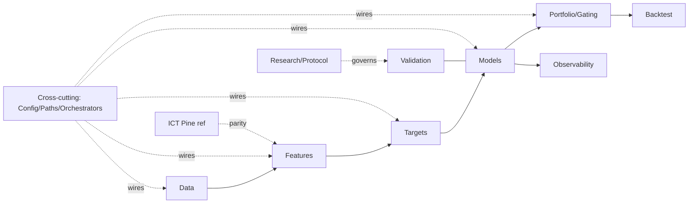

# ml-stock-predictor — Repository Overview (Master Router)

**Read this first in every session, then load ONLY the domain file(s) your task touches.**

## Purpose
ML-driven stock prediction: a LightGBM LambdaRank model ranks cross-sections of US (SP500+NDX+SP400/600, ~1600 tickers) and NSE stocks on forward excess returns, producing gated weekly watchlists. Validation rigor is a first-class product.

## Current Phase
**Phase 5 — feature selection & label research** (`Phase5_Research_Plan.md`): prune the >100-feature space (Exp-501 VIF, Exp-502 OOS SHAP triage, Exp-502b ablation arbiter, Exp-503 orthogonalization) and select the label horizon 5/10/20d (Exp-504). Pivots permanently disabled. ICT is **not** actually disabled project-wide — see Quick Traps below and `.ai/domain-ict.md`. The older MODEL_* campaign is history — evaluate this branch on its own merits.

## Tech Stack
Python 3.10+, pandas/numpy/pyarrow, **LightGBM (production model)**, Optuna, SHAP, numba, scipy, yfinance + local CSVs (data outside repo, see `paths.yaml`), Streamlit dashboard, Hetzner for heavy runs. CatBoost/XGBoost are in requirements but removed from the production path.

## Architecture (DDD)

Domains communicate only via the panel DTO (`(date,ticker)` MultiIndex), `MarketConfig`, `PATHS`, and emitted artifacts; composition happens only in orchestrators (`run_*_local.py`, `train.py`, `infer.py`).

## Non-Negotiable Constraints
- **Zero lookahead**: cutoff-aware per-fold recomputation of stateful features; PIT joins on `filed`/membership dates; leakage suite asserts before every training run.
- **Lockbox discipline** (`PROTOCOL.md`): pass/fail bars committed before running; a holdout read is one-shot, Human-authorized only; results are upper bounds.
- Every new threshold/gate/weight is a logged researcher degree of freedom; no hard IC cutoffs without t-stat guards.
- NaN-native features/labels (never fillna); seeds always set; fail loudly on missing data; paths only via `PATHS`, market constants only via `MarketConfig`.

## Conventions
- `CLAUDE.md`: context-compression protocol; verify token counts with `scripts/tools/count_tokens.py` (char-compression ≠ token-compression).
- Commits: conventional prefixes, **no Co-Authored-By trailers**. Workflow: `.ai/development-workflow.md`.

## File Index
| File | One-liner |
|---|---|
| `.ai/repo-overview.md` | This router — read first, then load the relevant domain. |
| `.ai/domain-data.md` | Ingestion, panel assembly, universe eligibility, PIT membership, causal zone labels. |
| `.ai/domain-features.md` | Feature engineering + sub-domains (zones, ICT, fundamental, sector, structure/pivots) and causality invariants. |
| `.ai/domain-targets.md` | Forward-return labels, horizons, NaN-tail contract, composite rank label. |
| `.ai/domain-models.md` | LGBM LambdaRank wrapper, ensemble, train/infer entry points. |
| `.ai/domain-validation.md` | Purged CV, leakage suite, walk-forward, neutralization, independent graders. |
| `.ai/domain-backtest.md` | Execution-cost simulation, T+1 fills, PnL reporting. |
| `.ai/domain-portfolio.md` | Quality gates (ssz/ict_bear), feature selection, position sizing, risk caps. |
| `.ai/domain-ict.md` | Pine reference engine + Python parity contract. |
| `.ai/domain-observability.md` | Drift/PSI monitoring, stale-data guards, SHAP, dashboard, reports. |
| `.ai/domain-research.md` | PROTOCOL.md, pre-registrations, Phase 5 backlog, one-shot lockbox rules. |
| `.ai/cross-cutting.md` | MarketConfig, paths, param registry, shared utils, run orchestrators. |
| `.ai/repository-rules.md` | Coding/testing/git standards, folder→domain map, Definition of Done. |
| `.ai/development-workflow.md` | Idea→merge pipeline and agent/human role boundaries. |

## Quick Traps (verified 2026-07-26)
`main.py` is a stub — real entry points are `run_*_local.py`/`train.py`/`infer.py`. Two universe files: `pipeline/data/universe.py` (eligibility) vs `pipeline/universe.py` (PIT membership). Root `monitoring/` holds artifacts, not code. Run `git status` before trusting file state — several files are uncommitted/untracked. "ICT disabled for Phase 5" (commit `c584fba`) is only a `--feature_set` CLI flag on `run_us_local_alpha.py`, default `"all"` (ICT on); `run_sp500_local.py` never got that flag at all and always trains on full ICT. A narrower `--feature_set ob_fvg` (Order Blocks + FVG only, added 2026-07-26) exists on both scripts but not on the NSE run scripts. Claude Code skills `data-pipeline`, `feature-gates`, `model-validation` hold deeper operational detail; these files link to them, not duplicate them.
