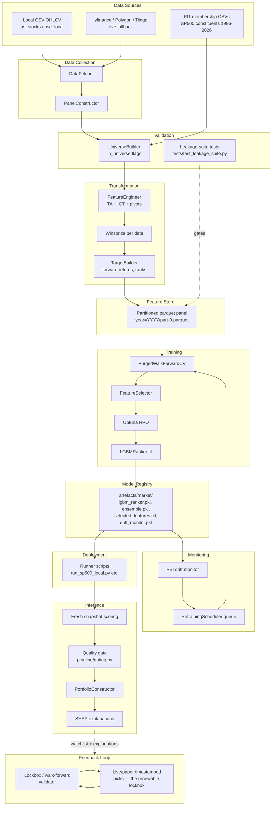

[← Back to index](README.md)

# Conceptual Architecture

<Conceptual Diagram — Data Sources → Feature Store → Training → Registry → Inference → Monitoring → Feedback>

### Stage-by-stage explanation

#### 1. Data Sources & Collection

**Level 1 — Executive Summary.** We start with the same raw ingredient every stock analysis needs: the daily record of what a stock's price and trading volume did, going back years, plus a list of which stocks were actually "in the index" at each point in history (not just today's list).

**Level 2 — Plain English.** Think of it like a library of daily newspaper front pages for every company, going back a decade or more, plus a roster sheet of who was on each sports team roster in each season — not just this season's roster, because otherwise you'd wrongly assume every player on today's team was always a star (that's "survivorship bias").

**Level 3 — Technical Deep Dive.** `pipeline/data/fetcher.py`'s `DataFetcher` fetches OHLCV via yfinance/Polygon/Tiingo (`fetch_single`, `fetch_many`, `fetch_benchmark`, `fetch_fx`) as the live-data path; the primary/validated path is local CSVs under `stock_data/{market}` (see the `data-pipeline` skill for CSV conventions, symbol-reuse traps, and dead-ticker handling). Point-in-time universe membership comes from `stock_lists/membership_sp500.csv` (1,202 tickers: 503 current + ~699 ex-members, coverage 1996–2026), consumed with `--pit_universe`. **Design decision:** local CSV-first, because live-provider rate limits and API-key dependencies make validated, reproducible runs fragile. **Alternative considered:** live-only fetching — rejected because a lockbox run must be exactly reproducible from a frozen dataset. **Trade-off:** local CSVs can go stale; `tests/test_stale_data_guard.py` exists specifically to catch this.

#### 2. Validation

**Level 1.** Before any stock is allowed to compete for a rank, we check it was actually a real, tradable member of the universe on that date — no using 2026 hindsight to include stocks in a 2015 snapshot.

**Level 2.** Like a judge in a competition checking that every contestant was actually registered before the event started, not added to the roster afterward because they happened to win.

**Level 3.** `UniverseBuilder.build_in_universe_flags` marks rows tradable based on: monthly reconstitution (first trading day of month), minimum 20-day ADV, minimum market cap, minimum trading history, and delisting status. `tests/test_leakage_suite.py` and `tests/test_critical_invariants.py` assert no forward-looking information crosses the train/test boundary. **Design decision:** universe eligibility recomputed monthly, not daily, to mirror how a real index reconstitutes and to avoid over-fitting to daily universe churn. **Common pitfall:** if no symbol master is loaded, sectors default to `Unknown` and market cap may be `NaN`, which can silently exclude every ticker from the universe (documented caveat in [CODE_EXPLANATION.md](../CODE_EXPLANATION.md)).

#### 3. Transformation (Feature Engineering + Targets)

**Level 1.** Raw prices are turned into meaningful signals — "is this stock unusually strong relative to its own recent history and its sector," "is it near a level where big buyers/sellers have acted before" — and we also compute, for training only, what actually happened next (so the model has something to learn from).

**Level 2.** Like a chef prepping ingredients: raw vegetables (prices) get washed, chopped, and turned into a mirepoix (features) before they go in the pot. Separately, the taste-tester's notes on how each past dish actually turned out (targets) get recorded so the recipe can be improved.

**Level 3.** `FeatureEngineer.build` computes ~150+ `features_*` columns per ticker inside `groupby(level="ticker")` (to prevent cross-ticker leakage): ATR percentile rank, volatility compression, ADX, ATR-normalized returns (1/5/20/60d), distance from 52-week high, SMA slope/distance, volume ratios, rolling beta, ICT order blocks/FVGs/demand-supply zones, sector relative strength, market breadth, benchmark regime dummies, plus the OFF-by-default pivot family (`features_pivot_*`, 69 columns) and structure family (`features_{major,internal}_*`). All `features_*` columns are winsorized cross-sectionally per date at 1st/99th percentile. `TargetBuilder` computes `future_20d_return`, `benchmark_20d_return`, `future_20d_excess_return`, `cs_rank_20d` (cross-sectional percentile rank of forward excess return), and quintile labels, with `MAX_FORWARD_HORIZON=20` and `PURGE_HORIZON=40`. **Design decision:** normalize by ATR rather than raw price so features are comparable across a $5 stock and a $500 stock. **Alternative considered:** raw price levels as features — rejected, not comparable across tickers and not stationary over time. **Common pitfall:** `MultiTFMerger`'s `atr_pct`, `weekly_vol`/`monthly_vol`/`quarterly_vol`/`yearly_vol`, and `return_20d`/`return_60d` columns lack the `features_` prefix and are silently excluded from model training by prefix-based discovery — a documented gotcha, not a bug users should "fix" without checking downstream impact first. (`weekly_trend`/`monthly_trend`/`quarterly_trend`/`yearly_trend` are *not* in this category — `engineer.py` explicitly re-exposes those four under `features_*`; see [Feature Engineering § Trend](05-ml-design/02-feature-engineering/09-trend.md).)

#### 4. Feature Store

**Level 1.** The finished, ready-to-use ingredients are saved to disk in an organized way so training doesn't have to re-cook everything from scratch every time.

**Level 2.** Like a pantry organized by year — you can grab exactly the shelves (years) you need instead of re-shopping and re-prepping every ingredient each time you cook.

**Level 3.** `PanelConstructor.save` writes partitioned parquet: `{output_dir}/year=YYYY/part-0.parquet`, indexed by `MultiIndex(date, ticker)`. `load(input_dir, years=None)` reads back a sorted panel. This is a lightweight, file-based feature store — not a managed feature-store product (e.g., Feast/Tecton). **Design decision:** parquet partitioned by year, chosen for simplicity and because the dataset (hundreds of tickers × years of daily bars) comfortably fits on local/single-server disk without needing a distributed store. **Alternative considered:** a managed feature store — rejected as premature infrastructure for the current data volume and single-operator use case. **Future improvement:** if the universe grows materially (e.g., full Russell 3000 + intraday), revisit.

#### 5. Training

**Level 1.** The system studies years of past examples — "given these characteristics, did the stock outperform its benchmark over the next month?" — and learns a ranking rule, always checking itself on data it hasn't been trained on to avoid fooling itself.

**Level 2.** Like a student studying with practice exams from *earlier* chapters and then being tested on a *later* chapter they've never seen — never letting them peek at the answer key for the test.

**Level 3.** See [Machine Learning Design](05-ml-design/README.md) for full detail: `PurgedWalkForwardCV` (expanding window, purge=40d, embargo=5d) → `FeatureSelector` (missingness filter, Spearman correlation pruning, permutation importance, SHAP stability) → Optuna HPO (`make_optuna_objective`, `mean_ndcg@10 - 0.5*std_ndcg@10`, pruned on non-positive top-decile excess) → final `LGBMRanker` fit → `EnsembleRanker` blend.

#### 6. Model Registry

**Level 1.** Once training is done, the finished model and everything needed to reproduce its decisions are saved in one place, labeled by market.

**Level 2.** Like a chef's recipe card filed in a labeled binder — anyone can pull the exact recipe used for a given dish without asking the chef to remember it from memory.

**Level 3.** Artifacts under `artefacts/{market}/`: `lgbm_ranker.pkl`, `ensemble.pkl`, `drift_monitor.pkl`, `optuna_study_meta.json`, `selected_features.txt`. This is a filesystem-based registry, not MLflow/SageMaker Model Registry. **Design decision:** filesystem registry, chosen for zero infra overhead at current scale (single operator, few markets). **Future improvement:** if multi-user or automated retraining pipelines are introduced, migrate to a versioned registry (MLflow) with lineage back to the git commit and data snapshot.

#### 7. Deployment & Inference

**Level 1.** Every week, the saved model looks at the freshest available data and produces a ranked shortlist of stocks, filtered through a rule-based sanity check, and explains its top picks.

**Level 2.** Like a weekly report from a very consistent analyst who never gets tired, never forgets to check the same things twice, and always shows their work.

**Level 3.** `pipeline/infer.py` / runner scripts: load artifacts → build a **fresh** snapshot (not the tail of the training panel, to avoid stale/training-only data) → engineer features → filter `in_universe == True` → score with `EnsembleRanker` → apply `momentum_bull_quality_gate` (momentum-bull only) → `PortfolioConstructor` → SHAP per-stock explanations → weekly drift check → write `watchlist_YYYYMMDD.csv` + `explanations_YYYYMMDD.json`. **Design decision:** fresh snapshot instead of panel tail, explicitly to reduce the risk of leakage/staleness — a deliberate architectural rule, not an accident.

#### 8. Monitoring & Feedback Loop

**Level 1.** The system watches whether the world has changed enough that its old training no longer applies, flags it, and — separately — every week's live picks become a permanently clean test of the strategy going forward.

**Level 2.** Like a smoke detector for "has the market's personality changed" plus a diary of predictions written down *before* you know the outcome, so you can't fool yourself later about how good your predictions really were.

**Level 3.** `FeatureDriftMonitor` computes PSI per feature vs. a training baseline; alerts above `psi_alert_threshold` (0.20), sets `retrain_flag` above `psi_retrain_threshold` (0.25), and triggers a retrain recommendation if >20% of monitored features breach threshold. `RetrainingScheduler` queues one pending job per market (`monitoring/retrain_queue.json`). The feedback loop closes through the **lockbox protocol**: a fenced, pre-registered walk-forward re-derivation (see [PROTOCOL.md](../../PROTOCOL.md)) is the primary falsification mechanism, and going forward, timestamped live/paper picks re-validated quarterly are "the only perfectly clean test" ([PROTOCOL.md §6.3](../../PROTOCOL.md)).

---

**Previous:** [← 02 · Business Context](02-business-context.md) &nbsp;|&nbsp; **Next:** [04 · Functional Design →](04-functional-design.md)
