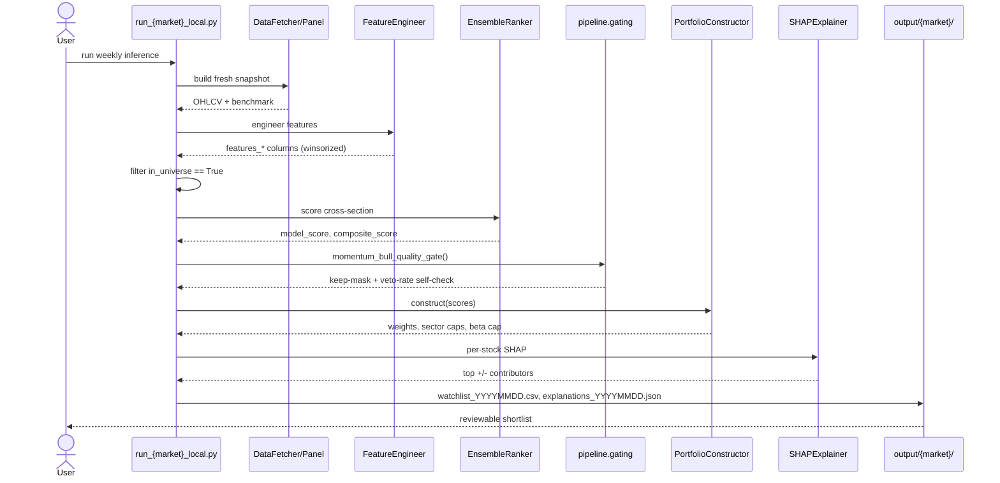

[← Back to index](README.md)

# Functional Design

### User Personas

| Persona | Goal | Touchpoint |
|---|---|---|
| Researcher/Strategy Owner | Decide whether the edge is real; evolve the recipe | PROTOCOL.md, walk-forward runners |
| Weekly User (watchlist consumer) | Get a ranked, explained shortlist to review | `output/{market}/watchlist_*.csv`, `explanations_*.json` |
| ML Engineer | Improve features/model, keep tests green | `pipeline/`, `tests/` |
| QA / Reviewer | Verify no leakage, no regression | `tests/test_leakage_suite.py`, `test_critical_invariants.py`, `test_regression_guards.py` |
| Future Developer | Onboard a new market or feature family | `MarketConfig`, feature-gates skill |

### Primary Use Cases
1. **Weekly inference:** run `pipeline/infer.py` (or a market runner) → get bull/bear × momentum/reversal watchlists.
2. **Retraining:** run `pipeline/train.py` (or a market runner with fresh data) → new artifacts.
3. **Backtesting a recipe change:** run `pipeline/backtest_run.py` → HTML performance report.
4. **Validating the whole recipe honestly:** follow [PROTOCOL.md](../../PROTOCOL.md) end-to-end (seed fenced model → walk-forward through holdout → independent validator).
5. **Onboarding a new market:** add a `MarketConfig` preset (see [CODE_EXPLANATION.md — How to Add a New Market](../CODE_EXPLANATION.md)).

### User Journey (weekly inference)



### Inputs
- Ticker universe file (`--tickers_file`) or PIT membership CSV (`--pit_universe`).
- Historical price CSVs / live-provider fallback.
- `paths.yaml` (or `ML_DATA_ROOT` / `ML_PROJECT_ROOT` / `ML_ARTEFACTS_ROOT` env overrides).
- Market selection (`--market {sp500,nse,nasdaq}`), mode (`momentum`/`reversal`), date range.

### Outputs
- `output/{market}/watchlist_YYYYMMDD.csv` — ranked, gated, weighted shortlist.
- `output/{market}/explanations_YYYYMMDD.json` — per-stock SHAP explanation.
- `reports/report_{market}.html`, `equity_curve_{market}.parquet`, `performance_tables_{market}.json` — backtest outputs.
- `monitoring/feature_drift.parquet`, `monitoring/retrain_queue.json`.
- `lockbox_verdict.json` — independent validator output ([PROTOCOL.md §4 step 3](../../PROTOCOL.md)).

### Configuration
Central `MarketConfig` dataclass (`pipeline/config/base.py`) — identity, data sources, universe/liquidity thresholds, slippage tiers, rebalance schedule, risk limits (`max_sector_weight=0.40`, `max_single_stock_weight=0.15`, `max_portfolio_beta=1.3`), trade management (`profit_target_pct=0.08`, `stop_loss_pct=0.04`), drift thresholds (`psi_alert_threshold=0.20`, `psi_retrain_threshold=0.25`), `random_seed=42`, and experimental feature toggles (`use_structure_features`, pivot features via env var). Presets: `pipeline/config/sp500.py`, `nse.py`, `nasdaq.py`.

### Business Rules
- Momentum-bull candidates are vetoed if: `ssz_htf_score > 0.6` (overhead supply), `ict_bear_htf_score > 0.4` (bearish ICT structure), broken trend stack (`NOT(price>sma50 AND sma50↑ AND sma200↛↓)`), or `-DI > +DI` (ADX direction owned by bears). See [pipeline/gating.py](../../pipeline/gating.py).
- Bear/reversal candidates are **not** gated by the momentum-bull rule (documented as deliberate — "Bear/reversal untouched").
- Universe reconstitution is monthly (first trading day); signal rebalance is weekly (last trading day of ISO week).
- Sector weight capped at 40%, single-stock at 15%, portfolio beta at 1.3.

### Error Handling & Edge Cases
- **Gate inactive:** if none of the gate's feature columns exist in the panel, the gate is a no-op and prints a loud warning rather than silently filtering nothing (`pipeline/gating.py:85-88`).
- **Gate miscalibration alarm:** structural veto rate > 15% (3× the ~5% calibrated baseline) prints an explicit alarm to re-run the threshold sweep before trusting the list.
- **No symbol master loaded:** sectors default to `Unknown`, market cap may be `NaN`, which can exclude all tickers from the universe — a documented, non-obvious failure mode.
- **No tickers file supplied:** falls back to benchmark-only as a demo universe — explicitly "not a realistic equity-selection universe," must not be mistaken for a real run.
- **Delisted/halted tickers near the forward horizon:** ranker target rows with unknowable forward rank are **dropped**, not zero-filled (fixed 2026-06-26 — previously corrupted the LambdaRank label by scoring them as rank 0, the worst possible rank).
- **Stale local CSVs:** guarded by `tests/test_stale_data_guard.py`.

### API Contracts
There is no external HTTP API for the core pipeline (it is a batch/CLI system). `api/forward_eval_server.py` exposes a small forward-evaluation service — see [System Design](08-system-design.md) for its role. CLI "contracts" are the argument surfaces of the runner scripts, e.g.:

```bash
# Training
python -m pipeline.train --market sp500 --tickers_file tickers.txt \
    --start 2010-01-01 --end 2023-12-31 --n_folds 12 --n_trials 40

# Inference
python -m pipeline.infer --market sp500 --top_n 10 --tickers_file tickers.txt

# Backtest
python -m pipeline.backtest_run --market sp500 --top_n 10
```

**Sample watchlist row (illustrative schema, not live output):**
```json
{
  "ticker": "AAPL",
  "date": "2026-07-04",
  "mode": "momentum",
  "side": "bull",
  "model_score": 0.842,
  "composite_score": 0.771,
  "weight": 0.083,
  "sector": "Technology",
  "gate_passed": true
}
```

**Sample explanation payload:**
```json
{
  "ticker": "AAPL",
  "top_positive_features": [
    {"feature": "features_atr_norm_return_20d", "shap_value": 0.041},
    {"feature": "features_dist_from_52w_high", "shap_value": 0.028}
  ],
  "top_negative_features": [
    {"feature": "features_ict_bear_htf_score", "shap_value": -0.012}
  ],
  "similar_setups": {"n_matches": 47, "historical_win_rate": 0.61}
}
```

---

**Previous:** [← 03 · Conceptual Architecture](03-conceptual-architecture.md) &nbsp;|&nbsp; **Next:** [05 · Machine Learning Design →](05-ml-design/README.md)
