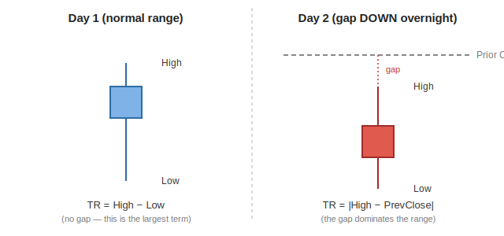

[← Back to Feature Engineering](README.md) &nbsp;|&nbsp; [← Back to ML Design overview](../README.md) &nbsp;|&nbsp; [← Back to index](../../README.md)

# ATR — Average True Range

## Level 1 — Executive Summary
Before you can say a stock's move is "big" or "small," you need to know what's normal for *that stock*. ATR is a rolling measurement of a stock's typical daily price swing. It's the ruler every other feature in this system is measured against — a $2 move means something completely different for a sleepy utility stock than for a volatile biotech, and ATR is what lets the model compare them fairly.

## Level 2 — Plain English
Imagine you're judging whether a hiking trail is steep. A 50-meter climb is nothing on a trail through the Rockies, but it's a serious climb on a trail through flat farmland. You can't judge "steep" in absolute meters — you need to know the trail's *typical* elevation change first. ATR is that baseline for a stock's daily price movement: once you know a stock typically moves 2% a day, a 6% move immediately reads as "3 ATRs" — unusually large — while the same 6% move on a stock that typically swings 8% a day is unremarkable.

## Level 3 — Technical Deep Dive

### True Range: why not just "high minus low"?
The naive measure of a day's range is `high − low`. But that misses **gaps** — if a stock closes at $100 and opens the next day at $90 on bad news, the "true" range that day includes the gap, even if the stock only moves $2 from its open. True Range takes the largest of three candidates:

```
TR = max( high − low,
          |high − prev_close|,
          |low  − prev_close| )
```



On Day 1 there's no gap, so `High − Low` is naturally the largest of the three candidates. On Day 2, the stock gapped down overnight — the prior close sits above today's entire trading range — so `High − Low` alone would understate the true move by the size of the gap; `|High − PrevClose|` correctly captures it instead.

### Wilder's smoothing, not a simple moving average
`_wilder_atr()` (`pipeline/features/ict_features.py`) computes ATR as an exponentially-weighted moving average of True Range with `alpha = 1/14`:

```python
tr  = max(high-low, |high-prev_close|, |low-prev_close|)
atr = TR.ewm(alpha=1/14, adjust=False).mean()
```

This is mathematically identical to J. Welles Wilder's original recursive formula, `ATR_t = (ATR_{t-1} × 13 + TR_t) / 14`, just expressed in pandas' vectorized EWM form.

**Why Wilder's EMA, not a plain 14-day rolling average?** A simple rolling mean has a "cliff-edge" problem: a volatility spike from 14 days ago falls out of the window all at once, causing ATR to jump even though nothing new happened today. Wilder's EMA *decays* old shocks smoothly instead of dropping them off a cliff — a spike's influence fades gradually, so ATR reacts quickly to new volatility but doesn't whipsaw on old data aging out. **Alternative considered:** plain N-day SMA of True Range — rejected for the cliff-edge behavior above; this is also why every other Wilder-family indicator in this codebase (ADX, ±DI) uses the same `alpha=1/14` smoothing for consistency.

### The illiquid-ticker floor
```python
atr_floor = |close| * 5e-4        # 5 basis points of price
safe_atr  = atr if (atr is valid and atr > atr_floor) else atr_floor
           (NaN stays NaN — never silently replaced with a fake floor)
```
On a stale or illiquid ticker, ATR can decay toward zero (the stock just isn't trading). Every feature in the system that *divides* by ATR (returns, SMA distances, zone/ICT/pivot distances) would then explode toward infinity — and because winsorization happens *per date across the whole cross-section*, one exploding stock can distort the clip bounds for every healthy stock on that date too. Flooring ATR at 5bps of price treats "essentially flat" as noise, not signal, without inventing a value for tickers where ATR is genuinely unknown (NaN stays NaN — the model reads NaN as "unknown," not zero).

### Two units of ATR — and why both exist
| Unit | Formula | Used for | Why |
|---|---|---|---|
| **Absolute ATR** (₹ or $) | `safe_atr` | `price_vs_sma20/50/200`, `sma*_slope_*` | Both numerator (price − SMA) and denominator (ATR) are in the same currency unit, so the ratio is dimensionless and comparable across stocks. |
| **Percentage ATR** | `pct_atr = safe_atr / close` | Normalizing **log returns** (`return_1d/5d/20d/60d`) | Log returns are already dimensionless (a ratio). Dividing a dimensionless return by an *absolute* ATR (₹) would make the feature's scale depend on the stock's price level — a 10% move on a ₹100 stock and a ₹10,000 stock would get wildly different feature values for the same percentage gain. Dividing by *percentage* ATR keeps the normalization consistent regardless of price level. |

### Downstream features built directly on ATR
- **`atr_pct_rank_252`** — rolling 252-trading-day (≈1 year) percentile rank of raw ATR. Answers "is this stock's volatility high or low *relative to its own recent history*" (not relative to other stocks).
- **`vol_contraction` = ATR14 / rolling-60d-max(ATR14)** — how compressed is volatility right now versus its recent peak. Values near 0 mean volatility has contracted sharply (often precedes a breakout).
- **`compression_score` = 1 − vol_contraction** — the same idea, inverted, so higher = more compressed.
- **`atr_expansion` = ATR14 / rolling-20d-mean(ATR14)** — values > 1 mean volatility is currently expanding versus its recent baseline. Used alongside the breakout flags (`20d_breakout`, `50d_breakout`) to separate a genuine momentum-igniting breakout from a weak, drifting one.
- Every zone, ICT, and pivot "distance from level" feature elsewhere in the system (see [Zones](05-zones.md), [ICT](06-ict.md), [Pivots](07-pivots.md)) is expressed as `(price − level) / safe_atr`.

### `hist_vol_20d` — a volatility measure that deliberately does *not* use ATR
```python
log_ret  = diff(log(close))
hist_vol_20d = std(log_ret, rolling 20d, min_periods=10) × sqrt(252)
```
This is a standard **annualized realized volatility** — the 20-day rolling standard deviation of daily log returns, scaled by `√252` (the number of trading days in a year) so it's expressed in the same "annualized volatility" units traders quote (e.g. "this stock has 35% annualized volatility"). Unlike almost every other feature in this system, `hist_vol_20d` is **not** divided by ATR. That's deliberate, not an oversight: a standard-deviation-based volatility measure is already a self-normalizing statistic in its own right (it's a volatility-of-returns, not a price-level distance), so dividing it by ATR again would be double-normalizing rather than making it comparable. It's a genuinely different lens on volatility than `atr_pct_rank_252`/`vol_contraction` above: those measure whether volatility is high or low *relative to the stock's own recent range*, while `hist_vol_20d` gives an absolute, cross-stock-comparable annualized figure.

### Design Decisions / Alternatives / Trade-offs
| Decision | Why | Alternative rejected |
|---|---|---|
| Wilder's EMA (`alpha=1/14`) | Smooth decay of old shocks, no cliff-edge | Plain 14-day SMA of TR (whipsaws when old spikes age out) |
| Floor at 5bps of price, NaN-preserving | Prevents illiquid-ticker ATR collapse from exploding every dependent feature | A tiny epsilon floor like `1e-6` (previously used) — this let invalid ATR produce million-fold return explosions rather than a clean NaN |
| Two units (absolute vs. percentage) | Match the dimensionality of whatever is being normalized | Using one universal unit everywhere — would introduce a price-level dependency in the return features |

### Common Pitfalls
- Confusing "ATR is low" with "the stock is safe" — a compressed ATR (low `vol_contraction`) is often a *precursor* to an explosive move, not an indicator of low risk going forward.
- Comparing raw ATR values across stocks directly — always use `atr_pct_rank_252` (relative to the stock's own history) for that comparison, not the raw ATR number.

### Future Improvements
None currently planned — ATR is a stable, foundational primitive with no open experimental variants (unlike pivots/structure).

---

**Previous:** [← Feature Engineering overview](README.md) &nbsp;|&nbsp; **Next:** [02 · ADX & Directional Movement →](02-adx.md)
