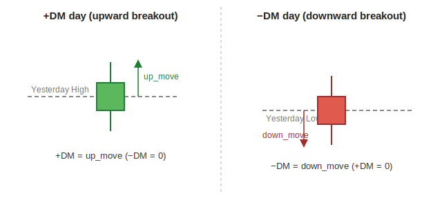

[← Back to Feature Engineering](README.md) &nbsp;|&nbsp; [← Back to ML Design overview](../README.md) &nbsp;|&nbsp; [← Back to index](../../README.md)

# ADX & Directional Movement (+DI / −DI)

## Level 1 — Executive Summary
ADX answers "how strong is the current trend" — but it deliberately does *not* say which direction. A separate pair of numbers, +DI and −DI, tells you whether that strength belongs to the buyers or the sellers. Together, they let the system distinguish "this stock is breaking out hard" from "this stock is collapsing hard" — two situations classic ADX alone cannot tell apart.

## Level 2 — Plain English
Think of ADX as a speedometer and +DI/−DI as the gear shift indicator (forward vs. reverse). The speedometer alone tells you the car is going 80 mph — impressive, but not useful if you don't know whether it's driving toward the finish line or off a cliff behind you. A stock crashing hard and a stock breaking out hard can both register the exact same "ADX = 36" reading; only +DI/−DI reveal which one is actually happening.

## Level 3 — Technical Deep Dive

### The building blocks: +DM and −DM
For each bar, "directional movement" measures how much of today's range extended beyond yesterday's range, in each direction:
```
up_move   = today_high  − yesterday_high
down_move = yesterday_low − today_low

+DM = up_move    if (up_move > down_move   and up_move   > 0) else 0
−DM = down_move  if (down_move > up_move   and down_move > 0) else 0
```
Only the *larger* of the two directional moves counts for that bar — a bar can't be both bullish and bearish at once.



### From DM to DI, and DI to ADX (Wilder's chain)
`_wilder_di()` and `_wilder_adx()` (`pipeline/features/ict_features.py`) chain three Wilder-smoothed (`alpha=1/14`) quantities:

```
+DI = 100 × EMA(+DM) / ATR
−DI = 100 × EMA(−DM) / ATR

DX  = 100 × |+DI − −DI| / (+DI + −DI)
ADX = EMA(DX)
```

+DI and −DI are each normalized by ATR (see [ATR](01-atr.md)) so the directional-movement magnitude is expressed relative to the stock's normal daily range, not its absolute price. ADX is derived from the *gap* between +DI and −DI — the bigger the gap (regardless of which side is bigger), the stronger the trend. This is exactly why raw ADX is direction-blind: `|+DI − −DI|` gives the same value whether +DI or −DI is the larger term.

### The direction-blindness bug this fixes (documented in code)
> *"Raw ADX is direction-blind: `abs(+DI − −DI)` gives the SAME value for a strong uptrend and a strong downtrend (NKE: ADX 36 in a falling stock read identically to a 36-ADX breakout)."* — `pipeline/features/engineer.py`

This was a real false-positive source: a stock with a clean, structurally broken downtrend (falling below its 50/200-day averages) could still show a high, "impressive-looking" ADX value, and a naive feature/rule relying on ADX alone couldn't tell it apart from a genuine bullish breakout.

### The fix: expose direction explicitly
```python
adx_dir  = sign(+DI − −DI)              # +1 = bulls in control, −1 = bears in control
adx_bull = ADX  if (+DI > −DI) else 0   # trend strength, ONLY when bulls own it
adx_bear = ADX  if (−DI > +DI) else 0   # trend strength, ONLY when bears own it
```
`adx_bull`/`adx_bear` is a **one-sided split** — the same "dialect" used for the zone features `sdz`/`ssz` and the regime dummies `regime_bull`/`regime_bear` elsewhere in the system. A NKE-type bar (strong downtrend) now reads `adx_bull = 0, adx_bear = 36` — the model (and the rule-based quality gate) sees the direction *for free*, without needing to learn the +DI-vs−DI interaction itself.

### Downstream usage: the momentum-bull quality gate
`pipeline/gating.py`'s `momentum_bull_quality_gate` uses the raw +DI/−DI pair directly (not the split) as one of its four veto prongs:
```python
keep &= ~(minus_di > plus_di)   # veto if bears currently own the ADX direction
```
A momentum-bull candidate is rejected outright if −DI > +DI on the most recent bar — the rule-based sanity check that a "bullish momentum" pick shouldn't currently have the trend-direction indicator pointing down. See [Functional Design § Business Rules](../../04-functional-design.md#business-rules) for the other three prongs.

### Design Decisions / Alternatives / Trade-offs
| Decision | Why | Alternative rejected |
|---|---|---|
| Expose `adx_bull`/`adx_bear` as separate columns | Model doesn't have to learn the interaction between magnitude (ADX) and direction (+DI vs. −DI) from scratch | Feeding raw ADX + DI/−DI and hoping the tree splits find the interaction — works in principle, but wastes model capacity re-deriving something structurally obvious |
| **Excluded from winsorization** (`_WINSORIZE_EXCLUDE`) | ADX/DI live in a bounded `[0, 100]` range by construction — no outliers to tame. Critically, winsorizing the *one-sided* pair actively corrupts it: on a date where <1% of stocks sit on one side, the lower-percentile clip lifts the structural zeros ("other side in control") to a positive value, breaking the mutual exclusivity the split exists for. | Applying the standard per-date winsorize uniformly to all `features_*` columns |
| Wilder smoothing (`alpha=1/14`) throughout | Same rationale as ATR — smooth decay, no cliff-edge | Simple moving averages of DM/DX |

### Common Pitfalls
- Treating a high `adx_14` value alone as bullish confirmation — always pair it with `adx_dir`/`adx_bull`/`adx_bear`, or you'll re-introduce the exact NKE-style false positive this feature family was built to fix.
- Applying standard winsorization to `adx_bull`/`adx_bear` in a custom analysis — remember they're in the excluded set for a structural reason, not an oversight.

### Future Improvements
None currently planned. This family is stable and directly informs the production quality gate.

---

**Previous:** [← 01 · ATR](01-atr.md) &nbsp;|&nbsp; **Next:** [03 · Simple Moving Averages →](03-sma.md)
