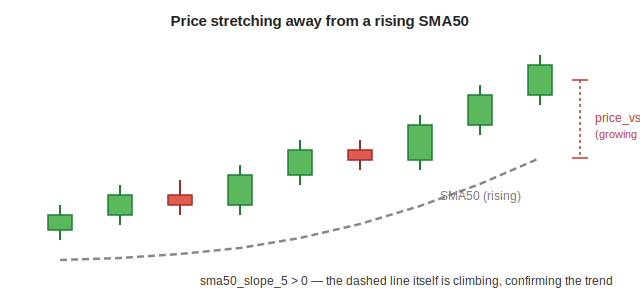

[← Back to Feature Engineering](README.md) &nbsp;|&nbsp; [← Back to ML Design overview](../README.md) &nbsp;|&nbsp; [← Back to index](../../README.md)

# SMA — Simple Moving Averages

## Level 1 — Executive Summary
A moving average smooths out day-to-day noise to reveal the underlying trend. This system tracks three: a short-term (20-day), medium-term (50-day), and long-term (200-day) average, and — more importantly — how far price sits above/below each one and whether each one is sloping up or down.

## Level 2 — Plain English
Imagine tracking a hiker's *average* altitude over the last day, week, and month instead of their exact position at every step. If today's altitude is way above their monthly average *and* that monthly average is itself climbing, they're clearly headed uphill on every timeframe — much more informative than a single altitude reading, which could just be a brief step up before continuing to descend.

## Level 3 — Technical Deep Dive

### The three windows
```python
sma20  = close.rolling(20,  min_periods=10).mean()
sma50  = close.rolling(50,  min_periods=25).mean()
sma200 = close.rolling(200, min_periods=100).mean()
```
`min_periods` is set to roughly half the window — a new listing with only 15 days of history still gets an `sma20` value (computed on those 15 days) rather than `NaN` for its entire first month, while still requiring *some* meaningful history before producing a number.



### Two derived measurements, both ATR-normalized
```python
def _sma_slope(sma_arr, lag):
    return (sma_arr - shift(sma_arr, lag)) / (safe_atr * lag)

sma20_slope_5   = _sma_slope(sma20,  lag=5)
sma50_slope_5   = _sma_slope(sma50,  lag=5)
sma200_slope_10 = _sma_slope(sma200, lag=10)

price_vs_sma20  = (close − sma20)  / safe_atr
price_vs_sma50  = (close − sma50)  / safe_atr
price_vs_sma200 = (close − sma200) / safe_atr
```

- **`price_vs_sma{20,50,200}`** — how many ATRs price currently sits above/below each average. This is a *stretch* measurement: a large positive value means price has pulled far away from its own trend line (potentially overextended), not just "above the average."
- **`sma{20,50,200}_slope_{5,10}`** — the average's own rate of change, normalized per bar by ATR. Dividing by `lag` as well as `safe_atr` converts the raw price change into an ATR-per-bar rate, so a 10-bar slope and a 5-bar slope are on the same comparable scale regardless of the lookback length used.

Both use **absolute** ATR (not percentage ATR) as the denominator, unlike the log-return features — see [ATR § Two units](01-atr.md#two-units-of-atr--and-why-both-exist) for why: here the numerator (`close − sma`) is already in currency units, so dividing by absolute ATR (also currency units) keeps the ratio dimensionless.

### Downstream usage: the momentum-bull "broken trend stack" veto
`pipeline/gating.py`'s quality gate directly encodes the classic technical-analysis "healthy trend stack" test as one of its four veto prongs:
```python
keep &= (price_vs_sma50 > 0.0) & (sma50_slope_5 > 0.0) & (sma200_slope_10 >= 0.0)
```
In plain terms: price above its 50-day average, the 50-day average itself rising, and the 200-day average not actively falling. A momentum-bull candidate failing any part of this — the "NKE-type" broken-trend-stack pattern documented in `pipeline/gating.py` — is vetoed outright, regardless of what the model's raw rank score said. See [Functional Design § Business Rules](../../04-functional-design.md#business-rules).

### 52-week range distance — the one pair of features that does *not* use ATR
```python
high_52w_dist = (close − rolling_252d_max(high)) / rolling_252d_max(high)   # always <= 0
low_52w_dist  = (close − rolling_252d_min(low))  / rolling_252d_min(low)    # always >= 0
```
Both are normalized by the **level itself** (a percentage distance), not by ATR — unlike the `price_vs_sma*` features above. `high_52w_dist` is near 0 when price is sitting at its 52-week high and grows increasingly negative the further below that high it trades. `low_52w_dist` is the bear-side mirror: near 0 means price is hugging its 52-week low — a documented breakdown-risk signal (`engineer.py`'s own comment: *"Near 0 = price hugging 52w low = breakdown risk. High value = price far above 52w low = not at support breakdown."*) — and a high value means price is comfortably far above any recent support failure.

### Breakout flags — deliberately excluding today's own bar
```python
rolling_20d_high = high.rolling(20, min_periods=10).max().shift(1)   # note the shift(1)
20d_breakout = 1.0 if close > rolling_20d_high else 0.0
# 50d_breakout is the same construction over a 50-day window
```
The `.shift(1)` is the important detail: the rolling high is computed over the **prior** 20 (or 50) bars, explicitly excluding today's own high — otherwise a breakout day would trivially compare today's close against a window that already includes today's own high, which can never be exceeded by construction. This is a subtly different (and stricter) causal convention than `high_52w_dist`/`low_52w_dist` above, which *do* include the current bar in their rolling window since they're answering "how far is price from its own recent range" rather than "did price just break out beyond a range that excludes today." Both `20d_breakout` and `50d_breakout` are read alongside `atr_expansion` (see [ATR](01-atr.md#downstream-features-built-directly-on-atr)) and volume ratios (see [Volume](04-volume.md)) to separate a genuine, momentum-igniting breakout from a weak, low-conviction one that happens to poke above a recent range.

### Design Decisions / Alternatives / Trade-offs
| Decision | Why | Alternative rejected |
|---|---|---|
| Simple (arithmetic) moving average, not exponential | Matches the industry-standard "50/200-day SMA" trend-stack convention the gating rule and most technical literature reference | EMA for SMA20/50/200 — would drift from the well-understood golden-cross/death-cross convention this feature family is meant to encode |
| `min_periods ≈ window/2` | Lets newer listings produce a usable (if noisier) SMA sooner rather than `NaN` for their whole first window | Requiring the full window before any value — would blank out every feature for a stock's first 50–200 trading days |
| ATR-normalized slope and distance | Comparable across stocks of different price/volatility levels | Raw currency-unit distance/slope — would make a $500 stock's SMA distance look artificially larger than a $20 stock's for the same percentage stretch |
| `high_52w_dist`/`low_52w_dist` normalized by the level itself, not ATR | A 52-week range is already a percentage-style "how stretched is price" measurement; ATR-normalizing a percentage would mix two different units of "extremeness" | Expressing 52-week distance in ATR units, matching the SMA-distance convention |
| Breakout flags use `.shift(1)` on the rolling high/low | Excludes today's own bar from the comparison window — a breakout event must be measured against a range that doesn't already include the very bar being tested | Comparing today's close against a rolling window that includes today (structurally biases toward false breakouts) |

### Common Pitfalls
- Reading `price_vs_sma200` in isolation as "bullish because positive" — a large positive value can equally mean an overextended, mean-reversion-risk setup. Always read it alongside the slope (is the average itself still rising) and the ADX direction (see [ADX](02-adx.md)).
- Assuming `sma20`/`sma50`/`sma200` values exist for the first weeks of a new listing's data — they do (thanks to `min_periods`), but they're built on a much smaller, noisier sample than a stock with years of history.
- Assuming `high_52w_dist`/`low_52w_dist` use the same ATR-based normalization as `price_vs_sma*` — they don't; they're percentage-of-level distances, a different unit entirely.
- Confusing `20d_breakout`/`50d_breakout` (a discrete 0/1 event flag, `.shift(1)`-guarded) with `high_52w_dist` (a continuous distance measurement that includes today's own bar) — they answer related but distinct questions and use different causal conventions on purpose.

### Future Improvements
None currently planned. This family directly encodes a widely-understood technical convention and is stable.

---

**Previous:** [← 02 · ADX & Directional Movement](02-adx.md) &nbsp;|&nbsp; **Next:** [04 · Volume →](04-volume.md)
