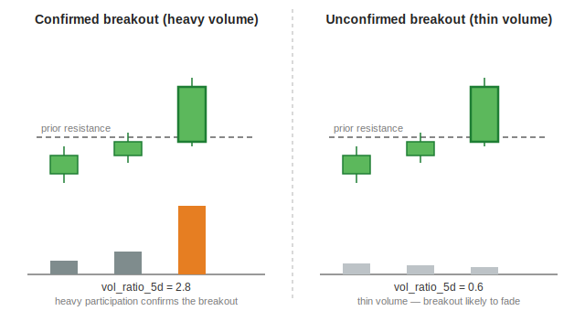

[← Back to Feature Engineering](README.md) &nbsp;|&nbsp; [← Back to ML Design overview](../README.md) &nbsp;|&nbsp; [← Back to index](../../README.md)

# Volume

## Level 1 — Executive Summary
Price tells you what happened; volume tells you how many people agreed. A price move on unusually heavy trading is a much stronger signal than the identical move on thin, quiet trading — this feature family measures exactly that: is today's (and this week's) participation unusually high or low relative to what's normal for this stock.

## Level 2 — Plain English
Imagine a rumor spreading through a small town versus the same rumor spreading through a packed stadium. The rumor's *content* might be identical, but the stadium version — heard and reacted to by far more people at once — carries far more weight and is far more likely to actually move behavior. Volume is the "how many people were listening" measurement for a price move.

## Level 3 — Technical Deep Dive

### Two ratios, two different questions
```python
vol_ma5   = volume.rolling(5,  min_periods=3).mean()
vol_ma20  = volume.rolling(20, min_periods=10).mean()
vol_ma60  = volume.rolling(60, min_periods=30).mean()

vol_ratio_5d  = volume  / vol_ma20     # today's volume vs. its own 1-month baseline
vol_ratio_20d = vol_ma5 / vol_ma60     # this week's baseline vs. its own 3-month baseline
```

- **`vol_ratio_5d`** answers: *"is today unusually loud, compared to the last month?"* A value of 2.5 means today's single-day volume is 2.5× the stock's own trailing-20-day average — a classic volume-spike signal, often accompanying a breakout, earnings reaction, or news event.
- **`vol_ratio_20d`** answers a slower version of the same question at a different timescale: *"has this whole recent week been louder than the last quarter, on average?"* This smooths out single-day noise (a 5-day average vs. a 60-day average) to detect a sustained shift in participation rather than a one-day blip.



### Why not just "raw volume"?
Raw share/dollar volume is not comparable across stocks — a mega-cap stock's "quiet day" volume can dwarf a small-cap's "unusually loud day" volume in absolute terms. Expressing volume as a *ratio to the stock's own recent history* makes it self-relative, the same normalization philosophy applied throughout this system (see [ATR](01-atr.md)). This mirrors the universe-eligibility check elsewhere in the pipeline, which also uses a stock's own `adv_20d_usd` (20-day average dollar volume) as the liquidity yardstick, rather than a fixed absolute threshold across all stocks.

### Relationship to other features
Volume ratios are read alongside the ATR-expansion feature (see [ATR § Downstream features](01-atr.md#downstream-features-built-directly-on-atr)) to distinguish a genuine institutional breakout (heavy volume *and* expanding volatility) from a low-conviction drift (price moves but participation and volatility both stay flat).

### Design Decisions / Alternatives / Trade-offs
| Decision | Why | Alternative rejected |
|---|---|---|
| Two separate ratios at different timescales (1-day-vs-month, week-vs-quarter) | Captures both a sudden single-day spike and a slower sustained shift in participation | A single ratio — would conflate a one-day news spike with a multi-week structural shift in liquidity |
| Ratio to the stock's *own* trailing average | Self-relative, comparable across mega-caps and small-caps alike | A fixed absolute volume threshold across the whole universe — would systematically favor large-cap names |

### Common Pitfalls
- Reading a high `vol_ratio_5d` as automatically bullish — a volume spike on a down day is a bearish confirmation signal (heavy selling), not a bullish one. Volume confirms whatever direction the price actually moved, it doesn't imply a direction on its own.
- Comparing raw `vol_ratio_5d` values across very different liquidity tiers without also checking `adv_20d_usd` — a thinly-traded microcap can produce wild, noisy ratio spikes from a handful of block trades.

### Future Improvements
None currently planned. This is a small, stable feature family.

---

**Previous:** [← 03 · Simple Moving Averages](03-sma.md) &nbsp;|&nbsp; **Next:** [05 · Zones →](05-zones.md)
