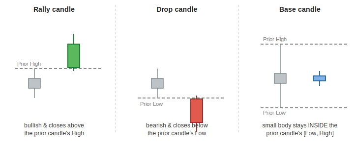
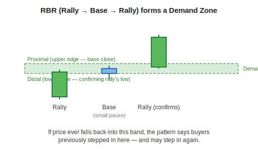
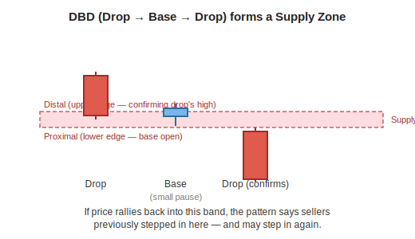
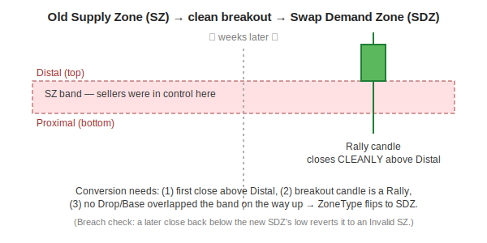

[← Back to Feature Engineering](README.md) &nbsp;|&nbsp; [← Back to ML Design overview](../README.md) &nbsp;|&nbsp; [← Back to index](../../README.md)

# Zones — Supply & Demand (DZ / SZ / SDZ / SSZ)

## Level 1 — Executive Summary
Certain price levels act like magnets — areas where institutional buyers or sellers previously stepped in aggressively, and are believed likely to do so again if price returns there. This feature family automatically detects those levels from raw candlestick patterns, tracks whether they're still "fresh" or have been invalidated by later price action, and even detects when an old selling zone has flipped into a new buying zone (or vice versa).

## Level 2 — Plain English
Imagine a popular restaurant that always has a line out the door at 7pm, but is empty at 3pm. If you show up at 7pm, you already know demand will be high there — you don't need to guess. A demand zone is the price equivalent: a level where, historically, a sharp rally followed a quiet pause, suggesting a concentration of buyers waiting there. A supply zone is the mirror image — a level where a sharp drop followed a quiet pause, suggesting sellers waiting there. And just like a restaurant that closes down and reopens as a completely different business, a zone can "flip" — a level that used to attract sellers can, after being decisively broken, start attracting buyers instead.

## Level 3 — Technical Deep Dive

This entire family is computed by `pipeline/utils/zone_analyzer.py`'s `ZoneAnalyzer`, wired into the panel via `pipeline/features/zone_features.py`, and aggregated into model-facing scores in `pipeline/features/engineer.py`. The pipeline runs eight steps, in order:

### Step 1–3: Classify every candle as Rally, Drop, or Base

```python
Rally: bullish candle (close > open) AND close > prior_high
Drop:  bearish candle (close < open) AND close < prior_low
Base:  candle's close sits INSIDE the prior candle's [low, high] range
       (a "Rally-Base" if the base candle itself closed up, "Drop-Base" if down)
```



### Step 4: Pattern-match three consecutive candles into a zone

A **group of consecutive Base candles** sandwiched between a candle on each side is pattern-matched into one of four shapes. Two form **Demand Zones (DZ)**, two form **Supply Zones (SZ)**:

| Pattern | Sequence | Zone type | Meaning |
|---|---|---|---|
| **RBR** | Rally → Base → Rally | **DZ** (Demand) | Price rallied, paused, then rallied again — the pause is where buyers were absorbing supply before continuing up. |
| **DBR** | Drop → Base → Rally | **DZ** (Demand) | Price dropped, paused, then reversed up — a "continuation demand" pattern; the pause marks where sellers exhausted and buyers took over. |
| **DBD** | Drop → Base → Drop | **SZ** (Supply) | Price dropped, paused, then dropped again — the pause is where sellers were absorbing demand before continuing down. |
| **RBD** | Rally → Base → Drop | **SZ** (Supply) | Price rallied, paused, then reversed down — a "continuation supply" pattern. |





### Step 5: Base elimination — invalidating stale zones
After a zone is identified, the engine watches all *future* price action: if any later candle's range (or any later zone's range) overlaps the `[Distal, Proximal]` band, the zone is marked `Invalid`. Intuitively: if price already came back and traded straight through a zone without reacting, the zone has been "used up" and is no longer a fresh, untested level.

> **Deliberate leakage, fixed downstream — read this carefully.** Base elimination and the swap-zone breakout detection below both look at *future* candles relative to the zone's own formation date — by design, this is how you'd validate a zone with hindsight. That means naively computing zones once on the full historical panel would leak future information into training rows. The fix lives in `zone_features.py`'s `compute_zone_features(cutoff_date=...)`: per CV fold, the zone engine is re-run using **only data up to the fold's training cutoff**, and the resulting labels are carried forward to test rows via `merge_asof`. So a test-period row sees the zone state *as it was known at the end of training* — never a zone validated using data the model wasn't allowed to see. See [`recompute_fold_features`](../../03-conceptual-architecture.md#5-training) in the training flow.

### Step 6–7: Swap zones — when a broken level flips sides

This is the more advanced concept: a Supply Zone that price later **cleanly breaks above** converts into a **Swap Demand Zone (SDZ)** — the old resistance becomes new support. The mirror image, a Demand Zone broken cleanly below, converts into a **Swap Supply Zone (SSZ)**.



The mirror process (`_identify_swap_supply_zones`) converts a Demand Zone (DZ) into a Swap Supply Zone (SSZ) when price cleanly breaks below it with a Drop candle and no obstruction — old support becoming new resistance.

### Multi-timeframe aggregation and the composite scores
The zone engine runs independently on five resampled timeframes — daily, weekly, monthly, quarterly, yearly — each with its own **zone-expiry window** (stale zones deactivate: 90 days on daily, up to 5 years on yearly) and its own **price-proximity band** (10% on daily up to 50% on yearly — a zone stays "relevant" only while price hasn't run too far past the breakout that confirmed it).

```python
_HTF_W = {"1d": 1, "1wk": 2, "1mo": 3, "3mo": 4, "1y": 5}   # higher TF = more weight
_MAX_SCORE = sum(_HTF_W.values()) * 2   # = 30 (SDZ/SSZ get 2x the weight of plain DZ/SZ)

sdz_raw_score = Σ (weight × 2) for each TF currently flagged SDZ, normalized to [0,1]
ssz_raw_score = Σ (weight × 2) for each TF currently flagged SSZ, normalized to [0,1]
```

**Trend-multiplied composite** — the score actually consumed downstream:
```python
up_mult = 0.5 + 0.375×(weekly_trend + monthly_trend + quarterly_trend + yearly_trend)   # range [0.5, 2.0]
dn_mult = 0.5 + 0.375×((1-weekly) + (1-monthly) + (1-quarterly) + (1-yearly))            # range [0.5, 2.0]

sdz_htf_score = sdz_raw_score × up_mult     # amplified when higher timeframes already agree bullish
ssz_htf_score = ssz_raw_score × dn_mult     # amplified when higher timeframes already agree bearish

zone_htf_confluence = sdz_htf_score − ssz_htf_score   # signed: + = bullish zone bias, − = bearish
```
The rationale (documented in `engineer.py`): a swap demand zone forming *while* the weekly/monthly/quarterly/yearly trends are all already up is a much stronger signal than the identical zone forming in a choppy or downtrending environment — the multiplier lets the model see that reinforcement directly rather than having to learn the interaction between five separate trend columns and two zone-score columns on its own.

### Daily proximity features: `zone_active`, `zone_dist_atr`, `zone_strength`

Distinct from the multi-timeframe composite scores above, three simpler features describe the **single nearest daily-timeframe zone** to current price:

```python
zone_active   = 1.0 if a relevance-gated zone (still fresh/tradeable) is currently in effect, else 0.0
zone_strength = 2.0 if that zone is a swap zone (SDZ/SSZ)     # required a confirmed breakout — structurally stronger
              = 1.0 if it's a plain zone (DZ/SZ)
              = 0.0 if none
zone_dist_atr = signed distance from price to the nearest zone's Proximal edge, in ATR units, clipped to [-20, +20]
```

**The distance sign convention** is oriented so a positive value always means "price is on the expected side of the zone, this many ATRs away":
```python
if nearest zone is DZ or SDZ (demand):  zone_dist_atr = (close − Proximal) / ATR   # + = price sits above support
if nearest zone is SZ or SSZ (supply):  zone_dist_atr = (Proximal − close) / ATR   # + = price sits below resistance
```

**A deliberate, easy-to-miss asymmetry:** `zone_active`/`zone_strength` use the **relevance-gated** zone type (`zone_type_1d` — the one subject to the age/proximity gates described above), but `zone_dist_atr` is sourced from the **ungated** nearest-zone lookup (`geom_zt_1d` in `zone_features.py`). The code comment explains why directly: *"geometry is well-defined whether or not the zone is still a 'fresh' tradeable signal."* In practice this means a zone that has aged out of the relevance window (so `zone_active = 0`) can still produce a meaningful, non-NaN `zone_dist_atr` reading — the two features answer different questions ("is there a *fresh* zone here" vs. "how far is the *nearest* zone geometrically"), and treating them as if they always agree is a common misreading.

### Downstream usage: the momentum-bull "overhead supply" veto
`pipeline/gating.py`'s quality gate vetoes a momentum-bull candidate outright if:
```python
ssz_htf_score > 0.6
```
This is the **calibrated threshold** discussed in [PROTOCOL.md](../../../../PROTOCOL.md) — calibrated on the US large/mid universe at ~5% combined structural veto prevalence, self-monitored every run (an alarm fires if the veto rate exceeds 15%, signaling the universe composition or feature distributions have shifted since calibration).

### Design Decisions / Alternatives / Trade-offs
| Decision | Why | Alternative rejected |
|---|---|---|
| Base elimination runs **last**, after swap detection | Matches the reference `market-vision` implementation's step order exactly; SDZ/SSZ zones (already promoted) are excluded from elimination since they've passed a stricter confirmation bar | Running elimination before swap detection — would eliminate zones that were about to be legitimately promoted to SDZ/SSZ |
| Per-fold recompute with `cutoff_date` | Both base elimination and swap detection look at *future* candles relative to a zone's formation — required to avoid training-time leakage | Computing zones once on the full historical panel (fast, but leaks future validation into every training row) |
| Two-pass merge, SDZ/SSZ overriding DZ/SZ (`zone_features.py`) | A monthly zone's *base date* can be old while its *breakout date* (SDZ/SSZ promotion) is recent — merging by base date alone would let a stale, less-relevant DZ/SZ label incorrectly override a fresher, more relevant swap zone | Single merge_asof by base date only |
| Higher timeframes weighted more (`_HTF_W`) | A yearly demand zone represents a much larger, more significant level than a daily one | Equal weighting across all five timeframes |

### Common Pitfalls
- Reading `zone_active` as "the zone is a good place to buy right now" — it only means the zone is still valid/untested; whether it's a demand or supply zone (and thus bullish or bearish) depends on `zone_type`.
- Assuming `zone_dist_atr` is `NaN`/meaningless whenever `zone_active = 0` — it isn't, by design (see above). `zone_dist_atr` is sourced from the ungated nearest-zone lookup, so it can hold a valid distance reading even when `zone_active` reports no *fresh* zone is currently in effect.
- Forgetting that SDZ/SSZ promotion is **directional and asymmetric**: only a *Supply* Zone can become an SDZ (demand), and only a *Demand* Zone can become an SSZ (supply) — the naming reflects what the zone becomes, not what it was.
- Assuming zone computation is leak-free by default — it is only leak-free because of the explicit per-fold `cutoff_date` recompute; skipping that step (e.g., in ad hoc analysis scripts) reintroduces the leakage the production training pipeline guards against.

### Future Improvements
None currently planned for the base DZ/SZ/SDZ/SSZ family — it feeds directly into the production gate. The separate BOS/CHoCH-based structure feature family (`use_structure_features`, OFF by default) is a related but distinct experimental effort — see [PROTOCOL.md](../../../../PROTOCOL.md) for its status.

---

**Previous:** [← 04 · Volume](04-volume.md) &nbsp;|&nbsp; **Next:** [06 · ICT (Order Flow) →](06-ict.md)
