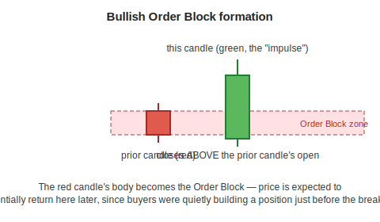
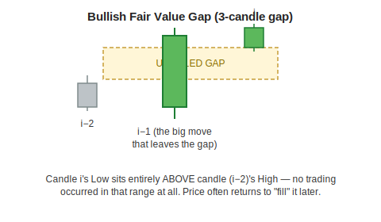
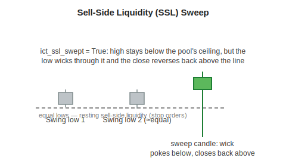
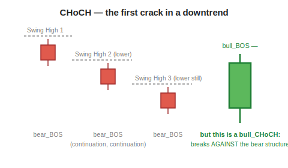
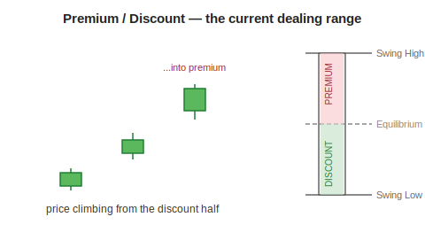

[← Back to Feature Engineering](README.md) &nbsp;|&nbsp; [← Back to ML Design overview](../README.md) &nbsp;|&nbsp; [← Back to index](../../README.md)

# ICT — Order Flow (Order Blocks, FVGs, Breaker Blocks, Liquidity, BOS/CHoCH)

## Level 1 — Executive Summary
ICT ("Inner Circle Trader") is a family of concepts describing *where and how large institutional traders likely built or unwound positions*, inferred purely from candlestick geometry — no special data feed required. This system implements six related ideas: **Order Blocks** (the last hesitant candle before an aggressive move), **Fair Value Gaps** (a price gap left by a fast, one-sided move), **Breaker Blocks** (a failed order block that flips into the opposite kind of level), **Liquidity Pools** (clusters of equal highs/lows that attract a stop-hunt), **Break of Structure / Change of Character** (objective trend and reversal signals), and **Premium/Discount** (whether a stock is currently "expensive" or "cheap" relative to its own recent trading range).

## Level 2 — Plain English
Imagine watching a poker table from outside the room, with no sound, only body language. You can't hear what anyone says, but a sudden, decisive all-in bet (an aggressive candle) tells you someone just made a big, confident move — and the seat they were sitting in before that bet (the order block) is worth remembering, because a confident player often returns to a level they've already proven they're willing to defend. A fair value gap is like a printing press running so fast it skips a serial number — the market moved so quickly that no one actually traded at some prices in between, leaving an "IOU" the market often comes back to fill later. A liquidity pool is like a cluster of parked cars all with the same alarm setting — obvious to anyone watching, and an easy, predictable trigger for someone who wants to intentionally set them all off before doing something else.

## Level 3 — Technical Deep Dive

All of ICT is implemented in `pipeline/features/ict_features.py`'s `ICTFeatureEngine`, run once per ticker per timeframe (daily, plus resampled weekly/monthly/quarterly/yearly for multi-timeframe composites). Every distance feature is expressed in ATR units (see [ATR](01-atr.md)).

---

### 1. Order Blocks — the last hesitant candle before a decisive move

An Order Block marks the **last opposite-colored candle immediately before a strong, structural move** — the theory being that this is where institutions were still accumulating/distributing before the move that reveals their position was underway.

```python
is_bull_OB = (prev_candle is red) & (this_candle is green)
           & (close > max(prev_open, prev_close))          # closes above the prior candle's body
           & (this_candle's body >= 1.2 × prev candle's body)   # decisively larger (pct_more=20% default)
```



Once formed, the Order Block stays **active** (tracked via `_ffill_zone`, forward-filled from its trigger bar) until one of:
- **Mitigated** — price closes back through the zone's far edge (`violated`, a one-way sticky latch — once mitigated, it stays dead until a brand-new OB overwrites it).
- **Expired** — no price reaction within `zone_expiry_bars` (63 bars ≈ 3 months on daily; shorter/longer on other timeframes).
- **Left behind** — price has run more than the proximity gate beyond the zone (10%+ on daily, wider on higher timeframes) — a *transient* state, distinct from mitigation, that can reactivate if price returns.

`ict_bob_fill_pct` (0.0 = untouched, 1.0 = fully violated) tracks how deep price has penetrated back into the zone — a graded signal rather than a binary "still alive/dead" flag. `ict_bob_disp_quality` (body ÷ total candle range on the formation candle) measures whether the impulse candle was a clean, decisive move (close to 1.0) or a wick-dominated, indecisive one (close to 0.0).

---

### 2. Fair Value Gaps (FVG) — a 3-candle price "IOU"

A Fair Value Gap is a price range that **no trading occurred in at all**, left behind by a fast, one-sided 3-candle move.

```python
is_bull_FVG = low[i] > high[i-2]     # today's low is entirely above the low
                                        of two candles ago's high — a genuine gap
```



Bearish FVG is the mirror image (`high[i] < low[i-2]`). A minimum-gap filter (`fvg_min_gap_atr = 0.1× ATR`) screens out trivially small, noise-level gaps. `ict_bullfvg_fill_pct` tracks how much of the gap has since been "filled" by returning price, same 0→1 convention as Order Blocks.

**Optional displacement gate** (`disp_mult`, default OFF/legacy mode): requires the move creating the OB/FVG to span at least N× ATR, filtering low-conviction drift from genuine institutional displacement. Dose-response testing (documented in `engineer.py`) found `disp_mult=1.0` thins the creation rate to a selective 14–25% "active" prevalence without breaking structural fidelity, while `disp_mult≥1.5` over-filters toward near-total annihilation of legitimate signals.

---

### 3. Breaker Blocks — a failed level flips sides

The mirror-image concept to zone swaps (see [Zones § Swap Zones](05-zones.md#step-67-swap-zones--when-a-broken-level-flips-sides)), but for Order Blocks: when a Bullish Order Block is **mitigated (violated)**, the level flips into a **Bearish Breaker Block** — the old "buyers were here" level becomes a new resistance, because the buyers who defended it clearly lost.

```python
bear_breaker_trigger = (bull_OB was active last bar)
                      & (bull_OB is no longer active this bar)
                      & (close < the old OB's low)   # confirmed by a decisive break-through
```

The production engine's *current* trigger for the closely-related "Rejection Block" pattern is a **liquidity-sweep rejection**: a swing low gets swept (see Liquidity Pools below), then a decisive reversal candle closes back above the prior candle's body — a "turtle soup" style failed breakdown, exported under the legacy `ict_bullrb_active`/`ict_bearrb_active` columns and prioritized above plain Order Blocks in the zone-priority hierarchy (`FVG=1 < OB=2 < RB=3 < Breaker=4`) since it requires a more specific, higher-conviction confirmation.

---

### 4. Liquidity Pools & Sweeps — where stop-losses cluster

Equal (or near-equal) highs and equal lows are exactly where retail stop-losses tend to cluster — just above a recent swing high (shorts' stops) or just below a recent swing low (longs' stops). A "sweep" is when price briefly pokes through that level (triggering the stops) and then **reverses back**, leaving those clustered orders "swept."



The full liquidity engine (`_run_liquidity_engine`, a Numba-JIT state machine) is considerably richer than a single sweep flag — it maintains a live registry of up to 300 candidate pools per side, tracking for the nearest pool on each side: distance from price, sweep depth, pool width, touch count, a recency-weighted "strength" score, and a decayed time-since-last-sweep. Pools merge when a new swing forms close to an existing one (within `merge_prox = 0.25× ATR` of the pool's originating ATR), age out after an expiry window scaled by how often they've been touched, and die immediately if price displaces cleanly through them (absorbed into a decisive move rather than swept and reversed).

---

### 5. Break of Structure (BOS) & Change of Character (CHoCH)

**BOS** is the objective, mechanical definition of "the trend continued": price closes beyond the last confirmed swing extreme in the direction already established.
**CHoCH** is a *reversal* signal: a BOS that fires **against** the currently prevailing structure — i.e., the first bullish break after a run of bearish breaks (or vice versa).

```python
bull_BOS = close > last_confirmed_swing_high
bear_BOS = close < last_confirmed_swing_low

market_structure_state = sign of the most recent BOS direction (+1 / −1 / 0=neutral)
bull_CHoCH = bull_BOS AND (prior structure state was neutral or bearish)
bear_CHoCH = bear_BOS AND (prior structure state was neutral or bullish)
```



`ict_macro_regime` (a signed streak counter, `bull_streak − bear_streak`) exposes sustained trend context directly: a long bear streak means shorts have historically been the "safe" trend-following direction on that stock recently, and vice versa for bull streaks.

---

### 6. Premium / Discount — is price "expensive" or "cheap" right now?

Using the current **dealing range** (the span between the last confirmed swing low and swing high), the engine computes where price currently sits as a fraction of that range:

```python
equilibrium = (last_swing_high + last_swing_low) / 2
position    = (close − last_swing_low) / (last_swing_high − last_swing_low)
# position = 0.0 → sitting at the swing low, 0.5 → at equilibrium, 1.0 → at the swing high
in_discount = position < 0.5   # the "cheap" half of the range — ICT favors buying here
in_premium  = position > 0.5   # the "expensive" half — ICT favors selling here
```



In `"strict"` implementation mode (an optional, off-by-default configuration), premium/discount becomes a **hard gate**: a bullish Order Block or FVG only counts if it forms while price is in the discount half, and bearish setups only count in premium. The production **default is `"legacy"` mode**, where premium/discount is exposed as an informational feature (`ict_premium_disc_ratio`, `ict_in_premium`, `ict_in_discount`) rather than a hard filter — see the mode comparison below.

---

### Implementation modes: legacy vs. institutional vs. strict
```python
_ICT_IMPL_MODE = "legacy"   # production default — unchanged from prior behavior
```
| Mode | Behavior |
|---|---|
| **legacy** (default) | No hard gates — OB/FVG signals fire on their structural pattern alone. |
| **institutional** | Adds a hard requirement: OB/FVG must form near a recent Break of Structure (`bos_lookback` window) — filters out 2-candle patterns not tied to a confirmed structural break. |
| **strict** | Adds premium/discount alignment (bull setups only in discount, bear only in premium) *and* requires FVGs to be confirmed by a recent opposite-side liquidity sweep — the fullest replication of the reference indicator's "Strict ICT Mode." |

**This is a live, pre-registered research question, not a settled decision.** An audit (documented in [PROTOCOL.md](../../../../PROTOCOL.md)) found the legacy, 66-feature ICT-only subset produced a walk-forward mean IC of essentially zero (`-0.00002`, t = -0.01) in isolation, and the full 88-feature ICT v2 decomposition showed a 63% train→lockbox sign-flip rate — versus 0% for the 16 zone-core features. Institutional mode is a candidate fix (tightening OB/FVG to require BOS confirmation) but is explicitly **not yet evaluated** against the pre-2024 walk-forward window, and per the one-shot lockbox rule, may not be tuned against the 2024–2026 holdout. **Do not change `_ICT_IMPL_MODE` in production without first running that ≤2023 comparison and recording the result in PROTOCOL.md.**

### Multi-timeframe composite scores (mirrors the [Zones](05-zones.md) treatment)
```python
ict_bull_htf_score = Σ (TF weight × zone priority / 4) across 1d/1wk/1mo/3mo/1y, normalized to [0,1]
ict_bear_htf_score = (mirror)
# then trend-multiplied exactly like sdz/ssz_htf_score:
ict_bull_htf_score *= up_mult   # amplified when weekly/monthly/quarterly/yearly trends already agree bullish
ict_bear_htf_score *= dn_mult
ict_htf_confluence  = ict_bull_htf_score − ict_bear_htf_score
```

### Downstream usage: the momentum-bull "bearish structure" veto
`pipeline/gating.py` vetoes a momentum-bull candidate if `ict_bear_htf_score > 0.4` — a calibrated threshold measured on 22,000 momentum-universe rows to catch 4.1% of candidates, of which 3.8% were **not** already caught by the zone-based `ssz_htf_score` prong (see [Zones](05-zones.md)) — i.e. the two engines are complementary, not redundant, catching different failure cases.

### Design Decisions / Alternatives / Trade-offs
| Decision | Why | Alternative rejected |
|---|---|---|
| No absolute ATR displacement gate on OB/FVG creation by default | An earlier 3.0× ATR gate annihilated 100% of Order Blocks and 99% of FVGs — breaking fidelity to the reference indicator's purely structural definition | A hard displacement floor baked into the base creation rule |
| Zone-priority deduplication (BK > RB > OB > FVG) via `np.maximum`, not summation | Summing priorities (e.g. OB=2 + FVG=1 = 3) could accidentally exceed both thresholds and wipe out both signals; max-based dedup correctly keeps only the highest-priority signal on a conflicting candle | Additive priority scoring |
| One-way mitigation latch (a violated zone stays dead until a new trigger) | Without it, a zone could "resurrect" every time price re-crosses the still-forward-filled boundary, making `active` flicker and corrupting distance features and SHAP attributions | Re-evaluating violation fresh on every bar |
| Deferred deactivation for swept liquidity pools (`p_deact_next`) | A swept pool needs to stay "active" through its own triggering bar so `sweep_cnt`/`sweep_dep` are visible to the model that day, then die at the start of the next bar | Immediate deactivation on the sweep bar (would make sweep features structurally always zero — a real bug this fix addresses) |

### Common Pitfalls
- Treating `ict_bear_htf_score` as a standalone bearish signal without checking `zone_htf_confluence` — the audit above shows the ICT-only signal is weak in isolation; it's used as a *complementary veto*, not a primary ranking feature.
- Assuming `institutional`/`strict` mode is strictly "better" because it's stricter — it has not yet cleared its own pre-registered validation gate; changing the production default without that step violates the project's researcher-degrees-of-freedom discipline.
- Confusing the legacy "Rejection Block" trigger (liquidity-sweep + reversal) with the textbook "Breaker Block" definition (mitigated OB revisited from the opposite side) — the code exports both concepts under related but distinct column families; check `pipeline/features/ict_features.py`'s class docstring for the exact taxonomy in use.

### Future Improvements
- Complete the ≤2023 walk-forward comparison of `legacy` vs. `institutional` implementation mode (pre-registered in PROTOCOL.md, not yet run).
- Re-evaluate the full ICT feature pool's contribution now that the 2026-06-26 unprefixing fix (previously ~50 ICT columns were silently invisible to the model) has landed — the audit numbers above predate that fix.

---

**Previous:** [← 05 · Zones](05-zones.md) &nbsp;|&nbsp; **Next:** [07 · Pivots →](07-pivots.md)
