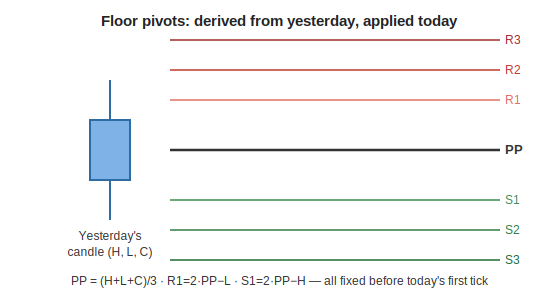
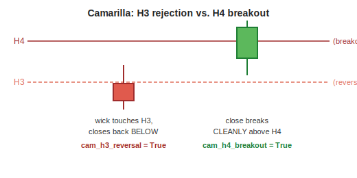

[← Back to Feature Engineering](README.md) &nbsp;|&nbsp; [← Back to ML Design overview](../README.md) &nbsp;|&nbsp; [← Back to index](../../README.md)

# Pivots — Floor Pivots, CPR & Camarilla

> **Status: experimental, OFF by default.** This entire family is gated behind the `PIVOT_FEATURES` environment variable and does **not** affect the production panel, model, or watchlists unless explicitly enabled. See [PROTOCOL.md §3.1](../../../../PROTOCOL.md) for the pre-registered CV gate this family must pass before it can be used in a lockbox or production run.

## Level 1 — Executive Summary
Every trading day, three classic formulas — floor pivots, the Central Pivot Range (CPR), and Camarilla levels — turn *yesterday's* high, low, and close into a small set of price levels for *today*. These levels are believed to act as natural support/resistance because so many market participants watch the same simple arithmetic. This family computes 69 features describing where price sits relative to those levels, whether the range between levels is unusually narrow or wide, and how price has behaved around them recently.

## Level 2 — Plain English
Imagine a weather forecaster who, every morning, draws a few reference lines on a chart based only on yesterday's temperature high and low — nothing fancier. Those lines aren't magic, but if *every* forecaster in town draws the same lines from the same public data, then enough people start reacting to them that the lines become genuinely useful to know, purely because so many people are watching the same thing. Floor pivots, CPR, and Camarilla levels work the same way in markets: simple, public, widely-watched arithmetic on yesterday's range.

## Level 3 — Technical Deep Dive

All formulas are implemented in `pipeline/features/pivots.py`'s `PivotFeatureEngine`, verified against Franklin Ochoa's *Secrets of a Pivot Boss*. **Every level is computed from the prior session's high/low/close (`shift(1)`)** — a level for today is fixed before today opens, so there is no leakage against today's own price action.

### Floor Pivots
```python
PP = (prior_high + prior_low + prior_close) / 3      # the "pivot point" — center of gravity
R1 = 2×PP − prior_low        S1 = 2×PP − prior_high   # first support/resistance
R2 = PP + prior_range        S2 = PP − prior_range
R3 = prior_high + 2×(PP − prior_low)
S3 = prior_low  − 2×(prior_high − PP)
```



### CPR (Central Pivot Range)
```python
BC = (prior_high + prior_low) / 2         # "Bottom Central"
TC = (PP − BC) + PP                       # "Top Central" — mirrors BC around PP
width = |TC − BC|                          # how wide today's CPR band is
```
**A correction applied here, deviating from the source draft (logged in PROTOCOL.md §3.1):** the raw TC/BC formula can invert (TC landing below BC) on certain candle shapes — the book itself notes this and its reference software simply assigns the higher value to TC and the lower to BC. This implementation normalizes at the source (`tc = max(tc_raw, bc_raw)`, `bc = min(...)`) so `width ≥ 0` always, and every downstream comparison (two-day relationship, trend side, opening relation, virgin-band check) is well-defined.

**CPR width regime** — a 60-day rolling percentile rank of the width feeds four derived signals: `cpr_regime_narrow` (bottom 25th percentile — a "coiled spring" setup often preceding a breakout), `cpr_regime_wide` (top 75th percentile — a choppy/wide range), `cpr_extreme_narrow` (bottom 10th percentile), and `cpr_compression_streak` (consecutive narrow days).

**Virgin CPR** — a Numba-accelerated scan checks whether today's high/low ever traded back inside a *prior* day's CPR band; if a prior CPR band has never been revisited, it's flagged "virgin" (`virgin_cpr_age`, `untouched_cpr_count`) — an untouched CPR band is considered a stronger magnet than one price has already churned through repeatedly.

### Camarilla Levels
```python
H3 = prior_close + prior_range × 1.1/4      L3 = prior_close − prior_range × 1.1/4
H4 = prior_close + prior_range × 1.1/2      L4 = prior_close − prior_range × 1.1/2
H5 = (prior_high / prior_low) × prior_close # a ratio-based projection, not a range-multiple
L5 = prior_close − (H5 − prior_close)       # mirrored around close
```
Camarilla levels are read behaviorally, not just geometrically:
- **`cam_h3_reversal`** — high touches H3 but closes back below it (a rejection at the first resistance tier).
- **`cam_h4_breakout`** — close breaks above H4 (the "breakout" tier — Camarilla's traditional reading treats H3/L3 as reversal zones and H4/L4 as breakout confirmation levels).
- **`cam_return_from_h4`** — high reaches H4 but closes back at/below it (a failed breakout).



### Opening Relationships & Two-Day CPR Relationship
`open_above_tc`/`open_below_bc` capture whether today's open already sits outside the CPR band before a single candle even forms — a strong directional bias signal in the ICT/CPR trading tradition. The **two-day CPR relationship** compares today's `[BC, TC]` band against yesterday's, using the book's *overlap* definition so all seven possible states are reachable (Higher Value, Lower Value, Overlapping Higher, Overlapping Lower, Inside Value, Outside Value, Unchanged) — **a deliberate enrichment over the source draft**, whose naive if-order left the two "overlapping" states structurally unreachable (logged as a documented deviation in PROTOCOL.md §3.1).

### Pivot Trend & PP Acceptance
```python
cpr_trend_bull = close > TC     cpr_trend_bear = close < BC     # else: Neutral (inside the band)
```
**A second correction over the source draft:** a naive `[close > BC, close < TC]` selection would misclassify an inside-the-band close as "Bullish" (since `close > BC` is trivially true whenever price is inside the band at all). This implementation fixes the ordering so inside-band closes are correctly labeled Neutral.

`pp_accept_streak` and `pp_accept_count_{5,10}d` track how many consecutive/recent days price has held above (or below) the plain Pivot Point — a simple, direct read on which side of the day's "center of gravity" the stock has been accepted.

### Nearest Level & Multi-Timeframe Pivots
A stack of 19 internal levels (floor pivots, CPR, Camarilla, plus two extra Camarilla sub-levels) is scanned each day to find the single nearest level to price in either direction (`dist_nearest_level_atr`, `dist_nearest_res_atr`, `dist_nearest_sup_atr`), plus weekly/monthly/yearly floor pivots computed the same shift-based way but from the last **completed** higher-timeframe period (via period-end resampling + `merge_asof(direction="backward", allow_exact_matches=False)` — the current, still-forming period is never visible).

### Why this family needs no per-fold leakage recompute (unlike Zones/ICT)
Every pivot feature is a **pure trailing function of OHLC through each row's own date** — no future candle is ever consulted, and nothing is retroactively revised by later price action (unlike a zone, which can be invalidated by a future candle, or an ICT sweep, which depends on future confirmation). This "truncation invariance" is directly tested (`tests/test_pivot_features.py::test_truncation_invariance`): computing pivots on the full history vs. a truncated prefix through any given date produces bit-identical values for that date. That's why `recompute_fold_features` explicitly **skips** pivot columns — recomputing them per fold would be pure wasted compute, not a leakage fix (contrast with [Zones](05-zones.md#step-5-base-elimination--invalidating-stale-zones) and [ICT](06-ict.md), where the per-fold recompute is mandatory).

### Design Decisions / Alternatives / Trade-offs
| Decision | Why | Alternative rejected |
|---|---|---|
| TC/BC min/max-normalization applied everywhere | The book's own reference software does this; applying it only in one place (as the source draft did) would leave `width` occasionally negative and every downstream comparison ill-defined | Leaving TC/BC un-normalized as the raw formula produces them |
| Trend side fixed so inside-band = Neutral | A naive comparison misclassifies inside-band closes as Bullish | The draft's original `[close>BC, close<TC]` select ordering |
| Two-day relationship uses the book's overlap definition | Makes all seven documented states reachable | The draft's if-order, which left overlapping states structurally unreachable |
| No per-fold recompute | Pivot features are provably truncation-invariant — recompute would be redundant | Treating pivots like zones/ICT and recomputing every fold anyway |
| Default OFF (`PIVOT_FEATURES` env var) | Keeps the production recipe bit-identical until a positive CV gate verdict is recorded | Enabling by default and relying on feature selection to discard it if unhelpful — violates the project's pre-registration discipline for new feature families |

### Common Pitfalls
- Enabling `PIVOT_FEATURES=1` in a production or lockbox run before the MODEL_D pre-registered CV gate (PROTOCOL.md §3.1) has recorded a PASS verdict — this is explicitly forbidden by the project's researcher-degrees-of-freedom discipline.
- Treating the family's internal parameters (60-day width lookback, 0.25/0.75/0.10 regime cutoffs, 60-day virgin lookback, 3d/5d PP-slope windows, 5d/10d acceptance windows, 1.1 Camarilla multiplier) as tuned — they are **book/draft defaults, prevalence-style, not outcome-validated**, and are counted as a single researcher-degrees-of-freedom ledger entry pending the MODEL_D verdict.

### Future Improvements
The MODEL_D pivot-only pre-registration (PROTOCOL.md §3.1) is the immediate next step: expanding-window walk-forward CV on yearly folds 2018–2023, with a fixed adoption bar (mean IC ≥ +0.03, t-stat ≥ 2.0, ≥4 of 6 folds positive). Only a PASS unlocks a one-shot lockbox diagnostic peek — result not yet recorded as of this writing.

---

**Previous:** [← 06 · ICT (Order Flow)](06-ict.md) &nbsp;|&nbsp; **Next:** [08 · Returns & Momentum →](08-returns-momentum.md)
