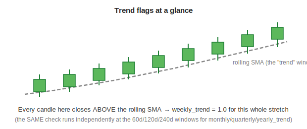

[← Back to Feature Engineering](README.md) &nbsp;|&nbsp; [← Back to ML Design overview](../README.md) &nbsp;|&nbsp; [← Back to index](../../README.md)

# Trend (Multi-Timeframe)

## Level 1 — Executive Summary
Four simple yes/no questions, asked at four different zoom levels: is this stock currently trading above its own weekly-scale, monthly-scale, quarterly-scale, and yearly-scale moving average? Individually each is a coarse signal; together they tell the model whether a stock's trend is aligned across every timeframe at once, or fighting itself (e.g. up on the weekly view but down on the yearly view).

## Level 2 — Plain English
Imagine checking a hiker's direction of travel by looking at their position over the last hour, the last day, the last week, and the last month, all at once. If all four views agree they're headed uphill, that's a much more convincing "this hiker is climbing" signal than if the last hour looks uphill but the last month has clearly been a steady descent. These four features are exactly that multi-zoom-level check, applied to a stock's price instead of a hiker's altitude.

## Level 3 — Technical Deep Dive

### Computation — `MultiTFMerger._rolling_trend` (`pipeline/features/multitf_merger.py`)
```python
lookbacks = {"weekly": 20, "monthly": 60, "quarterly": 120, "yearly": 240}   # trading days

for tf, window in lookbacks.items():
    sma          = close.rolling(window, min_periods=10).mean()
    {tf}_trend   = 1.0 if close > sma else 0.0
```

Despite the calendar-sounding names, these are **not** built by resampling to actual weekly/monthly/quarterly/yearly bars — the module's own docstring is explicit about this design choice:
```text
KEY DESIGN:
❌ NO resample-based calendar TFs
❌ NO merge_asof shifting hacks
✅ PURE rolling-window features aligned per row
```
Instead, `weekly_trend` is simply "is today's close above the rolling 20-*trading*-day average" — 20 trading days approximates a calendar month of weekly-scale price action, not a literal resample-to-weekly-bars computation. Each label (`weekly`/`monthly`/`quarterly`/`yearly`) is a shorthand for the *lookback window*, not a literal resampling frequency. This is a **different multi-timeframe approach** from the one used in [Zones](05-zones.md) and [ICT](06-ict.md), both of which genuinely resample OHLCV to weekly/monthly/quarterly/yearly bars via `.resample()`. The trade-off documented in the code: no `merge_asof` shifting logic is needed (a common source of subtle leakage bugs), at the cost of these "timeframes" being an approximation via trading-day windows rather than true calendar-period bars.



The same check runs independently against the 60d, 120d, and 240d rolling SMAs to produce `monthly_trend`/`quarterly_trend`/`yearly_trend` — a stock can easily be "trend=1" on the fast window and "trend=0" on the slow one at the same time.

### From `MultiTFMerger` into the model — the re-exposure step
`MultiTFMerger.merge()` joins `weekly_trend`, `monthly_trend`, `quarterly_trend`, `yearly_trend` into the panel **without** a `features_` prefix. `FeatureEngineer.build()` (`pipeline/features/engineer.py`) then explicitly re-exposes all four under the model-visible prefix:
```python
panel[f"{FEATURE_PREFIX}weekly_trend"]    = wt.astype(np.float32)
panel[f"{FEATURE_PREFIX}monthly_trend"]   = mt.astype(np.float32)
panel[f"{FEATURE_PREFIX}quarterly_trend"] = qt.astype(np.float32)
panel[f"{FEATURE_PREFIX}yearly_trend"]    = yt.astype(np.float32)
```
with the code comment: *"Expose trend as model features (`features_` prefix = visible to FeatureSelector). Yearly carries most predictive weight; daily/weekly least."* So `features_weekly_trend`/`features_monthly_trend`/`features_quarterly_trend`/`features_yearly_trend` genuinely reach the model as independent, learnable features — the LightGBM ranker is free to weight each timeframe's contribution on its own, rather than only seeing them pre-baked into a composite.

### Dual role: also drives the Zone/ICT trend multiplier
These same four columns simultaneously power the `up_mult`/`dn_mult` amplification used by [Zones § Multi-timeframe aggregation](05-zones.md#multi-timeframe-aggregation-and-the-composite-scores) and the equivalent ICT composite (see [ICT § Multi-timeframe composite scores](06-ict.md#multi-timeframe-composite-scores-mirrors-the-zones-treatment)):
```python
up_mult = 0.5 + 0.375×(weekly_trend + monthly_trend + quarterly_trend + yearly_trend)   # range [0.5, 2.0]
```
This is a deliberate design choice worth understanding clearly: the **raw trend flags are exposed as standalone features** *and* **consumed internally** to build the zone/ICT composite scores. The model therefore sees the same underlying information twice, in two different forms — once as four independent binary flags it can weight on its own, and once pre-multiplied into `sdz_htf_score`/`ict_bull_htf_score` as a hand-coded interaction. The `engineer.py` comment block explains the rationale for *not* going further and hand-coding every possible interaction: *"LGBM learns the interaction weights and TF hierarchy from data — we should not hand-code them"* (referring to a removed `sdz_premium_setup`/`ssz_premium_setup` feature that over-engineered this same idea). The four raw trend flags plus the composite multiplier is the deliberately-chosen middle ground between "hand-code everything" and "expose nothing but raw ingredients."

### Design Decisions / Alternatives / Trade-offs
| Decision | Why | Alternative rejected |
|---|---|---|
| Trading-day rolling windows (20/60/120/240), not calendar resampling | Avoids `merge_asof` shifting logic entirely — a documented source of subtle leakage bugs elsewhere in the codebase | Genuine `.resample()`-based weekly/monthly/quarterly/yearly bars, as Zones and ICT use |
| Expose raw trend flags **and** feed them into the zone/ICT multiplier | Lets the model learn its own weighting of each timeframe independently, while still giving it a pre-built, reinforced composite where multi-timeframe agreement is common and worth surfacing directly | Removing the raw flags now that the composite exists (would remove the model's ability to weight each timeframe independently) — or removing the composite and relying on the model to learn the interaction from four flags alone (found insufficiently reinforcing per the removed `sdz_premium_setup` experiment) |
| Binary (0/1) trend flags, not a continuous slope | Matches the "is it currently above/below" framing that the composite multiplier's linear blend (`0.375 ×` per timeframe) is built around | A continuous trend-strength measure per timeframe (would need its own separate design and calibration) |

### Common Pitfalls
- Assuming `weekly_trend`/`monthly_trend`/`quarterly_trend`/`yearly_trend` are computed from genuinely resampled weekly/monthly/quarterly/yearly OHLCV bars, the same way [Zones](05-zones.md) and [ICT](06-ict.md) compute their multi-timeframe features — they are not; they're trading-day rolling-window approximations by deliberate design (see `MultiTFMerger`'s docstring above).
- Believing these four columns were historically excluded from the model due to a missing `features_` prefix — that claim is **stale**; `engineer.py` explicitly re-exposes all four. (The columns that genuinely remain unprefixed and invisible today are `MultiTFMerger`'s `atr_pct`, `{tf}_vol`, and `return_20d`/`return_60d` — see [Feature Engineering overview § Common Pitfalls](README.md#common-pitfalls).)

### Future Improvements
None currently planned. This family is stable and feeds both a direct model input path and the zone/ICT composite scores.

---

**Previous:** [← 08 · Returns & Momentum](08-returns-momentum.md) &nbsp;|&nbsp; **Next:** [10 · Market Regime & Context →](10-market-regime-context.md)
