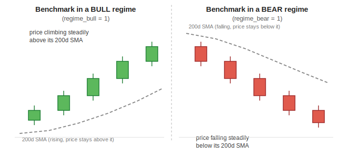

[← Back to Feature Engineering](README.md) &nbsp;|&nbsp; [← Back to ML Design overview](../README.md) &nbsp;|&nbsp; [← Back to index](../../README.md)

# Market Regime & Context

## Level 1 — Executive Summary
Every feature covered so far describes a stock relative to *itself*. This family is different — it describes the stock relative to *everything else trading around it*: is the overall market currently in a bull, bear, or choppy regime; is this specific stock's own sector doing better or worse than average right now; and is the broader market's participation broad and healthy, or narrow and fragile. These are cross-sectional and benchmark-level signals, not per-stock ones.

## Level 2 — Plain English
Judging a single runner's performance is very different depending on whether the whole field is running a personal-best race (a bull regime) or whether everyone is struggling in brutal heat (a bear regime) — the same finishing time means something completely different in each context. And within that race, you'd also want to know whether this specific runner is beating *their own training group* (sector relative strength), and whether it's a day where most runners in the field are having a good day or a bad one (market breadth) — three genuinely different, complementary pieces of context around the same individual performance.

## Level 3 — Technical Deep Dive

### Market Regime — `features_regime_bull` / `_choppy` / `_bear`
Computed once from the market benchmark (e.g. SPY, ^NSEI — `pipeline/config/{sp500,nse}.py`) and broadcast to every stock on that date (`FeatureEngineer._add_regime`):
```python
bull = (benchmark_close > benchmark_SMA200) & (benchmark_SMA20 > benchmark_SMA50)
bear = (benchmark_close < benchmark_SMA200) & (benchmark_SMA20 < benchmark_SMA50)
regime = 2 (bull) if bull else 0 (bear) if bear else 1 (choppy)

regime_bull   = 1.0 if regime == 2 else 0.0
regime_choppy = 1.0 if regime == 1 else 0.0
regime_bear   = 1.0 if regime == 0 else 0.0
```
This is the *same* trend-stack logic used per-stock in [SMA](03-sma.md) — price above its 200d average, with the 20d average above the 50d average — but applied to the **benchmark index** instead of the individual stock, and represented as three mutually-exclusive binary dummy columns rather than a single categorical value (so the tree model can split on each state independently rather than needing to learn an ordinal interpretation of a single 0/1/2 code).



A given stock's demand zone (see [Zones](05-zones.md)) forming during the bull regime on the left is forming in a tailwind — broad participation, easier follow-through. The IDENTICAL zone pattern forming during the bear regime on the right is forming against the prevailing current — a fundamentally different context for the same stock-level signal, which is exactly why regime is exposed as its own feature rather than assumed constant.

### Sector Relative Strength — `features_sector_rs_20d`
```python
ticker_ret20  = log(close / close.shift(20))                          # per-ticker 20d log return
sector_median = groupby([date, sector])[ticker_ret20].median()         # cross-sectional, same-date, same-sector
sector_rs_20d = ticker_ret20 − sector_median                           # simple excess return over sector median
```
Answers: *"is this specific stock outperforming or underperforming the median stock in its own sector, over the last month?"* A positive value means the stock is beating its sector peers; a negative value means it's lagging them, even if its absolute return happens to be positive.

**A documented fix, worth knowing about if you encounter old code or old artifacts referencing a different formula:** the current formula (`ticker_ret20 − sector_median`) replaced an earlier, buggy version, per the code's own comment: *"Previous formula (`ret/abs_med - sign(med)`) was asymmetric: a 0% return in a -5% sector gave +1.0 (100% 'outperformance') which is wrong."* The current simple-difference formula is symmetric and economically correct — a stock flat while its sector fell 5% genuinely outperformed by 5 percentage points, not by "100%."

### Market Breadth — `features_market_breadth`
```python
above_sma50 = (close > rolling_50d_sma(close)) AND (in_universe == True)   # per stock, per date
market_breadth = mean(above_sma50) across ALL in-universe stocks, for that date
```
The percentage of the *entire eligible universe* trading above its own 50-day average, on a given date — a classic "breadth" measure. This is a single number per date, broadcast identically to every stock on that date (unlike `sector_rs_20d`, which varies per stock). It answers a different question than the market-regime dummies above: regime asks "is the benchmark *index* in an uptrend," while breadth asks "how *broad* is that uptrend — is it being carried by a handful of mega-caps while most stocks quietly struggle, or is genuine widespread participation confirming it." A bull regime with low breadth is a classic warning sign (a narrow, fragile rally); a bull regime with high breadth is a healthier, more broadly confirmed one.

### Design Decisions / Alternatives / Trade-offs
| Decision | Why | Alternative rejected |
|---|---|---|
| Three binary dummy columns for regime, not one ordinal 0/1/2 column | Lets the tree model split on each regime state independently, without needing to learn an artificial ordering between bull/choppy/bear | A single categorical `regime` integer column |
| Sector RS as a simple difference (`ret − sector_median`) | Symmetric and economically correct at all sector-return levels, including negative ones | The prior ratio-based formula (`ret/abs_med − sign(med)`), fixed after it was found to produce a nonsensical "+100% outperformance" reading for a flat stock in a falling sector |
| Market breadth restricted to `in_universe == True` stocks | Keeps the breadth measurement consistent with the same eligibility standard used everywhere else in the pipeline (liquidity, market cap, listing history) | Computing breadth over every ticker in the raw panel, including thinly-traded or ineligible names that could distort the reading |

### Common Pitfalls
- Treating `regime_bull`/`regime_choppy`/`regime_bear` as stock-specific — they are **identical for every stock on a given date** (they describe the benchmark, not the individual stock). Do not expect them to vary cross-sectionally within a single day's data.
- Confusing `sector_rs_20d` (stock vs. its own sector peers) with `market_breadth` (the whole universe's participation rate) — they answer genuinely different questions and are computed at different levels of aggregation (per-stock-per-sector vs. one-number-per-date).
- Assuming a positive `sector_rs_20d` means the stock had a positive absolute return — it only means the stock beat its sector's median; a stock down 2% while its sector fell 8% still shows a strongly positive `sector_rs_20d`.

### Future Improvements
None currently planned. This family is stable and provides essential cross-sectional context that no single-stock feature family (ATR, ADX, SMA, etc.) can supply on its own.

---

**Previous:** [← 09 · Trend](09-trend.md) &nbsp;|&nbsp; **Next:** [03 · Learning Strategy →](../03-learning-strategy.md)
