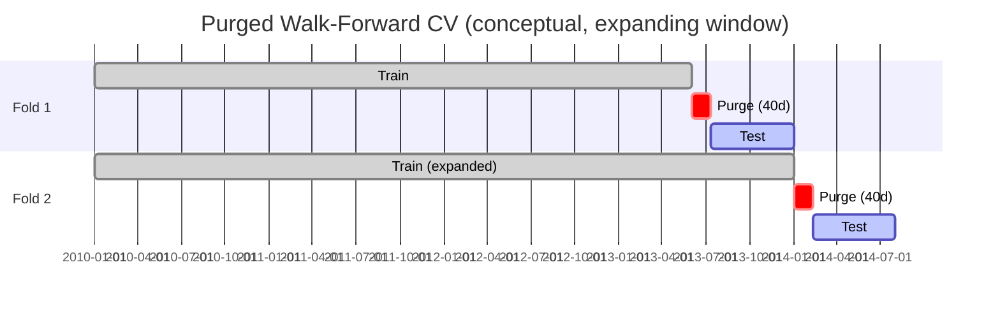

[← Back to ML Design overview](README.md) &nbsp;|&nbsp; [← Back to index](../README.md)

# Learning Strategy

**Level 1.** The model is a "gradient boosted decision tree" — essentially thousands of small decision rules stacked on top of each other, each one correcting the mistakes of the ones before it, trained specifically to get the *ranking order* right rather than any single number.

**Level 2 — Gradient Boosting analogy.** Imagine a team of interns each drawing a rough sketch of a portrait. The first intern draws a crude sketch. The second looks at where the first sketch was most wrong and focuses *only* on fixing those errors. The third does the same, focusing on what's still wrong after the first two. After hundreds of interns, the cumulative sketch is far better than any single intern could produce alone — that's boosting. **LambdaRank**, the specific flavor used here, additionally imagines each intern is told "don't just fix errors evenly — fix the errors that would most change the *final ranking order*, especially near the top of the list," because that's what actually matters for a top-N portfolio.

**Level 3 — Technical Deep Dive.**

**Model choice:** LightGBM with `objective=lambdarank`, `metric=ndcg`, `ndcg_eval_at=[10]` (`pipeline/models/lgbm_ranker.py`). Wrapped in an `EnsembleRanker` (`pipeline/models/ensemble.py`) that blends:
```
final_score = 0.9 * normalized(LGBM rank score) + 0.1 * normalized(inverse-volatility signal)
```
with a neutral 0.5 fallback for the volatility term when unavailable.

**Why LightGBM/LambdaRank?**
- Handles tabular, mixed-scale, nonlinear feature interactions natively (trees) without manual interaction engineering.
- Native missing-value handling (see [Feature Engineering](02-feature-engineering/README.md)).
- `lambdarank` directly optimizes the metric (NDCG) that matches how the output is consumed (top-N portfolio), rather than a proxy loss.
- Fast enough for Optuna HPO with dozens of trials × many CV folds on modest (2-CPU) compute.

**Alternatives rejected (historical, documented in code/PROTOCOL):**
- **CatBoost** (probability-calibrated) and **XGBoost baseline** — both were implemented, trained, and then **removed**. Reason: their pickled artifacts were never actually consumed by any downstream code, and a second GBM trained on the *same* features correlated 0.85+ with the LightGBM ranker — near-zero ensemble diversity for real added complexity. Retired code lives in `drafts/` for reference, not deleted, in case a genuinely diverse second model is revisited later.
- **Probability calibration layer** — removed for the same "built but never consumed" reason.
- **Pure regression models** (linear/ridge) — rejected as formulation mismatch (see [Problem Formulation](01-problem-formulation.md)); tree ensembles handle the nonlinear, regime-dependent feature relationships (e.g., ICT structure only matters conditionally) that linear models cannot.

**Training pipeline (`pipeline/train.py`):**
1. Load `MarketConfig`.
2. Set random seeds (`random_seed=42` default) for reproducibility.
3. Build/load historical panel.
4. Fetch benchmark prices.
5. Feature engineering.
6. Build forward-looking targets.
7. **Purged walk-forward CV** + **Optuna HPO**.
8. Final feature selection.
9. Train final `LGBMRanker`.
10. Assemble `EnsembleRanker`.
11. SHAP global explanations.
12. Fit feature drift baseline (`FeatureDriftMonitor.fit_baseline`).
13. Save artifacts.

**Cross-Validation — `PurgedWalkForwardCV` (`pipeline/validation/cv.py`):**
- Expanding-window (train grows over time, never shrinks).
- Minimum train window: 504 trading days (~2 years).
- Test window: 126 trading days (~6 months).
- **Purge window: 40 trading days** — removes training rows whose forward-return label window overlaps the test period, preventing label leakage across the boundary.
- **Embargo window: 5 trading days** — an additional buffer after the test period before the next fold's training data resumes, guarding against short-term autocorrelation leakage.
- Minimum folds: 5.
- Fold boundaries aligned to weekly `group_date`, not raw calendar days, so groups used for LambdaRank aren't split mid-week.



**Why purge + embargo, specifically?** The 20-trading-day forward-return label means a training row dated *just before* the test window's start already "knows" outcomes that land *inside* the test window unless purged — a classic and easy-to-miss leakage source in walk-forward finance ML. The embargo additionally protects against short-horizon serial correlation in returns bleeding label information across the boundary in the other direction.

**Regularization:** LightGBM's native regularization knobs (`num_leaves`, `min_data_in_leaf`, `lambda_l1`/`lambda_l2`, `feature_fraction`, `bagging_fraction`) are exposed to Optuna, alongside `feature_top_K` (how many selected features to actually use) — feature count itself acts as a regularizer against overfitting to noisy features.

**Optimization / HPO:** Optuna (`n_trials=40` typical for lockbox-scale runs) optimizing a **lower-confidence-bound style objective**:
```
mean_ndcg_at_10 - 0.5 * std_ndcg_at_10
```
i.e., reward high average fold performance but penalize *instability* across folds — a model that's great in 2 folds and terrible in 3 others is penalized relative to one that's consistently good. Trials are **pruned** early when top-decile excess return is not positive, saving compute on clearly non-viable trials.

**Loss function:** LambdaRank's implicit pairwise loss (approximates NDCG gradient via lambda gradients) — not a simple pointwise MSE/log-loss, precisely because the *pairwise ordering* is what's being optimized.

**Complexity / trade-offs:** boosted trees are more expensive to train than linear models and less interpretable *by default* — mitigated by the SHAP explainability layer (see [Explainability](../10-explainability.md)). HPO with purged walk-forward CV multiplies compute (trials × folds), which is why trial counts are deliberately reduced (`n_trials=40`) for tractability on the available 2-CPU compute, an explicit, documented trade-off between HPO thoroughness and wall-clock feasibility.

**Design Decisions summary table:**

| Decision | Why | Alternative Rejected |
|---|---|---|
| LightGBM LambdaRank | Matches ranking consumption pattern, native categorical/missing handling, fast | XGBoost/CatBoost (redundant, removed), linear regression (formulation mismatch) |
| Purged + embargoed expanding-window CV | Forward-return labels leak across naive splits | Simple k-fold or random split (catastrophic leakage in time series) |
| LCB-style Optuna objective (mean − 0.5·std) | Penalizes fold-to-fold instability, not just average | Pure mean NDCG (rewards lucky, unstable configs) |
| 90/10 LGBM/inverse-vol ensemble | Small, principled diversity/tilt toward lower-vol names | 85/15 with a second GBM blend (near-zero diversity, dropped per PROTOCOL.md finding that the blend roughly halves the edge) |

---

**Previous:** [← 02 · Feature Engineering](02-feature-engineering/README.md) &nbsp;|&nbsp; **Next:** [04 · Model Evaluation →](04-model-evaluation.md)
