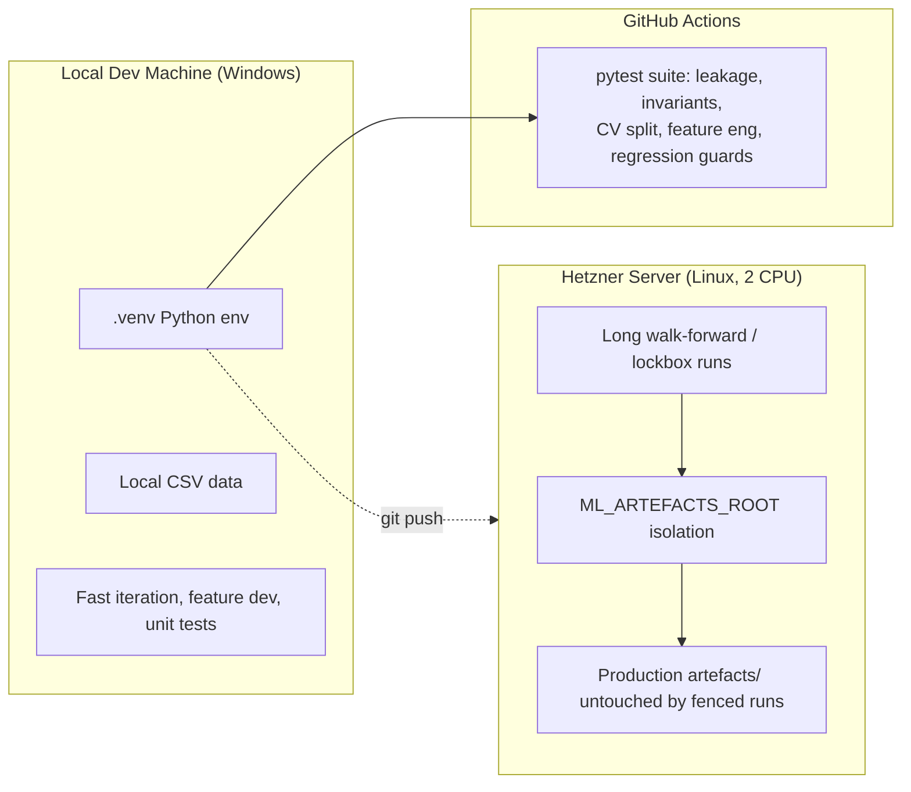

[← Back to index](README.md)

# Technical Architecture

**Tech Stack:**

| Layer | Choice |
|---|---|
| Language | Python |
| Data | pandas, numpy, pyarrow (parquet), scipy |
| Data fetch | yfinance, requests (Polygon/Tiingo REST), lxml |
| Calendar | pandas-market-calendars |
| ML | lightgbm (primary), scikit-learn, optuna (HPO), shap (explainability) |
| Retired (kept in `drafts/`) | catboost, xgboost |
| Numerics acceleration | numba |
| Reporting | matplotlib, Chart.js (via generated HTML) |
| Testing | pytest |

**Cloud/Infrastructure:** primarily local (Windows dev machine) for day-to-day iteration; a rented Hetzner server for longer walk-forward/lockbox jobs, isolated via `ML_ARTEFACTS_ROOT` so fenced runs cannot contaminate production artifacts. No managed cloud ML platform (SageMaker/Vertex) in use — a deliberate simplicity choice for a single-operator research system.

**CI/CD:** `.github/` workflow(s) run the pytest suite (leakage suite, critical invariants, CV split, feature engineering, regression guards) — the primary automated gate before merging changes.

**API Design:** batch/CLI-first; `api/forward_eval_server.py` provides a narrow forward-evaluation service surface (see [System Design](08-system-design.md)) rather than a general REST API for the whole pipeline.

**Authentication:** not applicable to the core pipeline (local/batch); any live data-provider API keys are handled via environment variables / local config, not committed to the repo.

**Caching:** the parquet feature-store panel *is* the cache — avoids recomputing features from raw OHLCV on every run. `momentum_lastdate.parquet` / `reversal_lastdate.parquet` cache last-computed-date bookkeeping for incremental runs.

**Databases:** none — file-based (parquet/CSV/JSON/pickle) storage throughout; appropriate at current data volume (hundreds of tickers, daily bars).

**Containerization:** not currently containerized; runs directly via Python virtualenv (`.venv`) locally and on the Hetzner box. Documented as a future-roadmap candidate if multi-environment reproducibility becomes a pain point.

<Infrastructure Diagram>

---

**Previous:** [← 06 · Data Architecture](06-data-architecture.md) &nbsp;|&nbsp; **Next:** [08 · System Design →](08-system-design.md)
