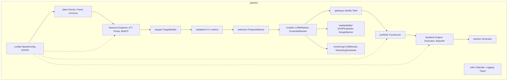
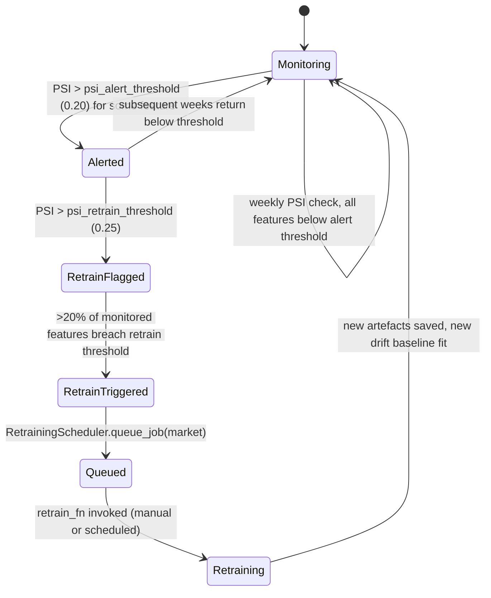

[← Back to index](README.md)

# System Design

**Component Diagram**

**Class Responsibilities (selected):**

| Class | Responsibility |
|---|---|
| `MarketConfig` | Single source of truth for all market-specific constants |
| `DataFetcher` | Retrieve OHLCV/benchmark/FX from configured provider |
| `PanelConstructor` | Build/persist the master (date, ticker)-indexed panel |
| `UniverseBuilder` | Compute `in_universe` eligibility flags |
| `FeatureEngineer` | Compute all `features_*` columns, per-ticker safe |
| `TargetBuilder` | Compute forward-return labels and ranks |
| `PurgedWalkForwardCV` | Expanding-window, purged, embargoed fold generator |
| `FeatureSelector` | Fold-scoped feature pruning/ranking |
| `LGBMRanker` | LambdaRank model wrapper |
| `EnsembleRanker` | Blend LGBM rank + inverse-vol tilt |
| `momentum_bull_quality_gate` | Rule-based veto of technically-broken momentum-bull picks |
| `PortfolioConstructor` | Convert scores → holdings + weights under risk limits |
| `BacktestEngine` | Simulate weekly rebalance with execution costs |
| `ExecutionModel` | ADV cap, slippage tiers, commission, market impact |
| `PerformanceReporter` | Compute Sharpe/Calmar/drawdown/turnover/attribution |
| `SHAPExplainer` | Global + per-stock explanation |
| `SetupMatcher` | Historical similar-setup matching |
| `FeatureDriftMonitor` | PSI-based drift detection |
| `RetrainingScheduler` | File-backed retrain job queue |

**State Machine — Retraining Trigger**

**Dependency Graph (module interaction, simplified):** `config` has no internal dependencies (leaf); every other module depends on `config`; `models` depends on `validation` + `selection`; `gating` depends on `models` output columns only (feature-name coupling, not class coupling); `backtest` depends on `models` + `portfolio` + `gating`; `explainability`/`monitoring` depend on `models` but not on each other.

**Event Flow (inference run):** snapshot build → feature engineering → universe filter → scoring → gating → portfolio construction → explanation → drift check → artifact write. Each step is a synchronous, sequential batch stage — there is no async/event-driven architecture, appropriate for a weekly-cadence batch system.

---

**Previous:** [← 07 · Technical Architecture](07-technical-architecture.md) &nbsp;|&nbsp; **Next:** [09 · Operational Lifecycle →](09-operational-lifecycle.md)
